### A. CEPH RADOS
 
- RADOS (Reliable Autonomic Distributed Object Store) là trái tim của hệ thống lưu trữ CEPH,. RADOS cung cấp tất cả các tính năng của Ceph, gồm lưu trữ object 
phân tán, sẵn sàng cao, tin cậy, kkhông có SPOF, tự sửa lỗi, tự quản lý,... lớp RADOS giữ vai trò đặc biệt quan trọng trong kiến trúc Ceph. Các phương thức 
truy xuất Ceph, như RBD, CephFS, RADOSGW và librados, đều hoạt động trên lớp RADOS. Khi Ceph cluster nhận một yêu cầu ghi từ người dùng, thuật toán CRUSH 
tính toán vị trí và thiết bị mà dữ liệu sẽ được ghi vào. Các thông tin này được đưa lên lớp RADOS để xử lý. Dựa vào quy tắc của CRUSH, RADOS phân tán dữ liệu
lên tất cả các node dưới dạng câc object. Cuối cùng ,các object này được lưu tại các OSD.

- RADOS, khi cấu hình với số nhân bản nhiều hơn hai, sẽ chịu trách nhiệm về độ tin cậy của dữ liệu. Nó sao chép object, tạo các bản sao và lưu trữ tại các zone
khác nhau, do đó các bản ghi giống nhau không nằm trên cùng 1 zone. RADOS đảm bảo có nhiều hơn một bản copy của object trong RADOS cluster. RADOS cũng đảm 
bảo object luôn nhất quán. Trong trường hợp object không nhất quán, tiến trình khôi phục sẽ chạy. Tiến trình này chạy tự động và trong suốt với người dùng,
do đó mang lại khả năng tự sửa lỗi và tự quẩn lý cho Ceph. RADOS có 2 phần: phần thấp không tương tác trực tiếp với giao diện người dùng, và phần cao hơn có 
tất cả giao diện người dùng.

RADOS lưu dữ liệu dưới trạng thái các object trong pool. Để liệt kê danh sách các pool:
` rados lspools `

Để liệt kê các object trong pool:
`  rados -p [pool] ls `

Để kiểm tra tài nguyên sử dụng:
` rados df `

#### RADOS có 2 thành phần lõi: OSD và MON

### B. OSD ( Object Storage Device ) 

- CEPH OSD lưu dữ liệu thực trên các ổ đĩa vật lý dưới dạng các object. Một Ceph cluster có rất nhiều OSD. Với bẩt cứ tác vụ đọc hoặc ghi nào, client gửi yêu 
cầu về cluster map tới node monitor, và sau đó tương tác trực tiếp với OSD cho các tác vụ đọc ghi, mà không cần sự can thiệp của node monitor. Điều này giúp 
việc chuyển tải dữ liệu nhanh chóng khi client có thể ghi trực tiếp vào các OSD mà không cần lớp xử lý dữ liệu trung gian. Cơ chế lưu trữ này là đôc nhất 
trên Ceph khi so với các phương thức lưu trữ khác.

- Ceph nhân bản mỗi object nhiều lần trên tất cả các node, nâng cao tính sẵn sàng và khả năng chống chịu lỗi. Mỗi object trong OSD có một primary copy và nhiều
secondary copy, được đặt tại các OSD khác. Bởi Ceph là hệ thống phân tán và object được phân tán trên nhiều OSD, mỗi OSD đóng vai trò là primary OSD cho một 
số object, và là secondary OSD cho các object khác. khi một ổ đĩa bị lỗi, Ceph OSD daemon tương tác với các OSD khác để thực hiện việc khôi phục. Trong quá 
trình này, secondary OSD giữ bản copy được đưa lên thành primary, và một secondary object được tạo, tất cả đều trong suốt với người dùng. Điều này làm Ceph 
Cluster tin cậy và nhất quán. Thông thường, một OSD daemon đặt trên mọt ổ đĩa vật lý , tuy nhiên có thể đặt OSD daemon trên một host, hoặc 1 RAID. Ceph Cluster
thường được triển khai trong môi trường JBOD, mỗi OSD daemon trên 1 ổ đĩa.

### 1. CEPH OSD File System

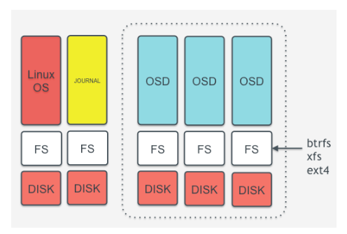

Thông thường mỗi một disk là một OSD , CEPH OSD sẽ bao gồm 1 ổ cứng vật lý , Linux filesystem và CEPH OSD service. Linux filesystem của Ceph cần hỗ trợ 
extended attribute (XATTRs). Các thuộc tính của filesystem này cung cấp các thông tin về trạng thái object, metadata, snapshot và ACL cho Ceph OSD daemon, 
hỗ trợ việc quản lý dữ liêu. Ceph OSD hoạt động trên ổ đĩa vật lý có phân vùng Linux. Phân vùng Linux có thể là Btrfs, XFS hay Ext4. Sự khác nhau giữa các 
filesystem này như sau:

- ` Btrfs `: filesystem này cung cấp hiệu năng tốt nhất khi so với XFS hay ext4. Các ưu thế của Btrfs là hỗ trợ copy-on-write và writable snapshot, rất thuận 
tiện khi cung cấp VM và clone. Nó cũng hỗ trợ nén và checksum, và khả năng quản lý nhiều thiết bị trên cùng môt filesystem. Btrfs cũng hỗ trợ XATTRs, cung 
cấp khả năng quản lý volume hợp nhất gồm cả SSD, bổ xung tính năng fsck online. Tuy nhiên, btrfs vẫn chưa sẵn sàng để production.

- ` XFS` :Đây là filesystem đã hoàn thiện và rất ổn định, và được khuyến nghị làm filesystem cho Ceph khi production. Tuy nhiên, XFS không thế so sánh về 
mặt tính năng với Btrfs. XFS có vấn đề về hiệu năng khi mở rộng metadata, và XFS là một journaling filesystem, có nghĩa, mỗi khi client gửi dữ liệu tới Ceph 
cluster, nó sẽ được ghi vào journal trước rồi sau đó mới tới XFS filesystem. Nó làm tăng khả năng overhead khi dữ liệu được ghi 2 lần, và làm XFS chậm hơn 
so với Btrfs, filesystem không dùng journal.

- ` Ext4 `: đây cũng là một filesystem dạng journaling và cũng có thể sử dụng cho Ceph khi production ,tuy nhiên, nó không phổ biến bằng XFS. Ceph OSD sử 
dụng extended attribute của filesystem cho các thông tin của object và metadata. XATTRs cho phép lưu các thông tin liên quan tới object dưới dạng ` xattr_name `
và ` xattr_value `, do vậy cho phép tagging object với nhiều thông tin metadata hơn. ext4 file system không cung cấp đủ dung lượng cho XATTRs do giới hạn về 
dung lượng bytes cho XATTRs. XFS có kích thước XATTRs lớn hơn.

### 2. CEPH OSD Journal 

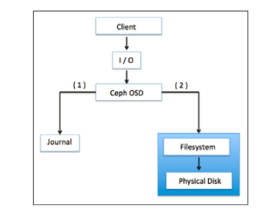

- Có thể hiểu đơn giản Journal disk chính là phân vùng cached để lưu trữ dữ liệu, Tăng tốc độ ghi dữ liệu. Sau đó Ceph sẽ flush dần data này xuống lưu trữ 
dưới disk.

- Ceph dùng các journaling filesystem là XFS cho OSD. Trước khi commit dữ liệu vào backing store, Ceph ghi dữ liệu vào một vùng lưu trữ tên là journal trước, 
vùng này hoạt động như là một phân vùng đệm (buffer), journal nằm cùng hoặc khác đĩa với OSD, trên một SSD riêng hoặc một phân vùng, thậm chí là một file 
riêng trong filesystem. Với cơ chế này, Ceph ghi mọi thứ vào journal, rồi mới ghi vào backing storage.

- Một dữ liệu ghi vào journal sẽ được lưu tại đây trong lúc syncs xuống backing store, mặc định là 5 giây chạy 1 lần. 10 GB là dung lượng phổ biến của journal,
tuy nhiên journal càng lớn càng tốt. Ceph dùng journal để tăng tốc và đảm bảo tính nhất quán. Journal cho phép Ceph OSD thực hiện các tác vụ ghi nhỏ nhanh 
chóng; một tác vụ ghi ngẫu nhiên sẽ được ghi xuống journal theo kiểu tuần tự, sau đó được flush xuống filesystem. Điều này cho phép filesystem có thời gian 
để gộp các tác vụ ghi vào ổ đĩa. Hiệu năng sẽ tăng lên rõ rệt khi journal được tạo trên SSD.

- Khuyến nghị, không nên vượt quá tỉ lệ 5 OSD / 1 journal đisk khi dùng SSD làm journal, vượt quá tỉ lệ này có thể gây nên thắt cổ chai trên cluster. Và khi 
SSD làm journal bị lỗi, toàn bộ các OSD có journal trên SSD đó sẽ bị lỗi. Với Btrfs, việc này sẽ không xảy ra, bởi Btrfs hỗ trợ copy-on-write, chỉ ghi xuống 
các dữ liệu thay đổi, mà không tác động vào dữ liệu cũ, khi journal bị lỗi, dữ liệu trên OSD vẫn tồn tại.

### 3. Ceph disk

Không nên sử dụng RAID cho Ceph Cluster:

- Mặc định Ceph đã có khả năng nhân bản để bảo vệ dữ liệu, do đó không cần làm RAID với các dữ liệu đã được nhân bản đó. Với RAID group, nếu mất 1 ổ đĩa, 
việc phục hồi sẽ yêu cầu một ổ đĩa dự phòng, tiếp đó là chờ cho dữ liệu từ đĩa bị hỏng được ghi lên đĩa mới, do đó việc sử dụng RAID sẽ gây mất nhiều thời 
gian khi khôi phục cũng như giảm hiệu năng khi so với giải pháp lưu trữ phân tán. Tuy nhiên, nếu hệ thống có RAID controller, ta sẽ đặt mỗi ổ đĩa trong một 
RAID 0.

- Phương pháp nhân bản dữ liệu của Ceph không yêu câu một ổ cứng trống cùng dung lượng ổ hỏng. Nó dùng đường truyền mạng để khôi phục dữ liệu trên ổ cứng 
lỗi từ nhiều node khác. Trong quá trình khôi phục dữ liệu, dựa vào tỉ lệ nhân bản và số PGs, hầu như toàn bộ các node sẽ tham gia vào quá trình khôi phục, 
giúp quá trình này diễn ra nhanh hơn.

- Sẽ có vấn đề về hiệu năng trên Ceph Cluster khi I/O ngẫu nhiên trên RAID 5 và 6 rất chậm.

### 4. Ceph volume

Ở phiên bản từ 11.x khái niệm ceph-volume được xuất hiện thay thế dần và tiến tới thay thế hoàn toàn cho ` ceph-disk `

### 5. OSD commands

- Lệnh để kiểm tra tình trạng OSD trên 1 node:
` service ceph status osd `

- Lệnh kiểm tra tình trạng OSD trên tất cả các node (lưu ý thông tin về tất cả OSD phải được khai báo trong ceph.conf):
` service ceph -a status osd `

- Lệnh kiểm tra OSD ID:
` ceph osd ls `

- Lệnh kiểm tra OSD map:
` ceph osd stat `

- Lệnh kiểm tra OSD tree:
` ceph osd tree `


### C. MON

- Các Ceph monitors lưu một "master copy" của cluster map, có nghĩa là một ceph client có thể xác định vị trí của tất cả Ceph monitors, Ceph OSD Daemons và 
Ceph metadata servers mà chỉ cần kết nối tới một Ceph monitor và lấy về một bản cluster map. Trước khi ceph client có thể đọc ghi vào Ceph OSD Daemon hoặc 
Ceph Metadata Servers, nó phải kết nối với Ceph Monitor trước. Với một bản sao cluster map và thuật toán CRUSH, ceph client có thể tính ra vị trí của bất kỳ 
object nào. Khả năng tính vị trí object này cho phép ceph client nói chuyện trực tiếp với OSD daemon, điều này rất quan trọng cho hiệu năng của ceph.

- Vai trò chính của Ceph Monitor là duy trì một bản copy của cluster map. Ceph Monitor cũng cung cấp dịch vụ xác thực và ghi log. Ceph monitor ghi tất cả 
những thay đổi trong dịch vụ monitor vào Paxos, Paxos ghi thay đổi này vào ` key/store`.

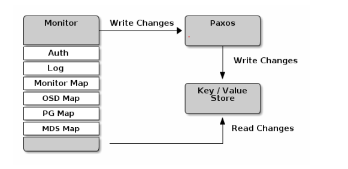

- Các monitors chịu tránh nhiệm giám sát trạng thái của toàn bộ hệ thống. Có các daemons giữ trạng thái của các thành viên trong cluster bằng cách lưu thông 
tin của cluster, trạng thái của mỗi node, thông tin cấu hình cluster. Ceph monitor giữ một bản sao master của cluster. Cluster map bao gồm monitor, OSD, PG, 
CRUSH, và MDS maps. Tập hợp các map này được gọi là cluster map. Chức năng cơ bản của mỗi map:

	- Monitor map: Lưu thông tin về các monitor node. Thông tin bao gồm ID cluster, hostname, IP và port. Monitor cũng lưu thông tin như lúc khởi tạo và 
	  lần cuối thay đổi.
	- OSD map: Lưu các thông tin như là ID cluster, epoch tạo OSD map và lần cuối cùng thay đổi ,và các thông tin liên quan đến pools như là pool name,
	  pool ID, type, số lượng replication, và PG (placement groups). Các thông tin về osd như là count, state, weight, last clean interval, và osd host.
	- PG map: map này lưu giữ các phiên bản của PG (thành phần quản lý các object trong ceph), timestamp, bản OSD map cuối cùng, tỉ lệ đầy và gần đầy 
	  dung lượng. Nó cũng lưu các ID của PG, object count, tình trạng hoạt động và srub (hoạt động kiểm tra tính nhất quán của dữ liệu lưu trữ).
	- CRUSH map: lưu các thông tin của các thiết bị lưu trữ trong Cluster, các rule cho từng vùng lưu trữ.
	- MDS map: lưu thông tin về thời gian tạo và chỉnh sửa, dữ liệu và metadata pool ID, cluster MDS count, tình trạng hoạt động của MDS, epoch của 
	  MDS map hiện tại.
### 1.Monitor Map

- Monitor map cho chúng ta biết thông tin về toàn bộ monitors trên cluster
- Một số lệnh sau để xem monitor map :

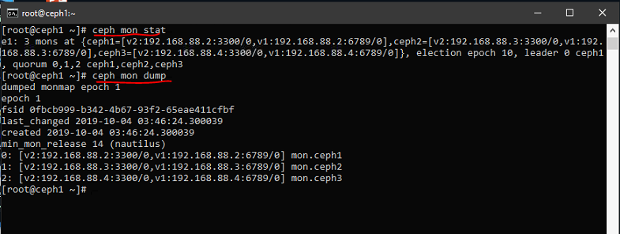


### 2. OSD map
- OSD map: Lưu các thông tin như là ID cluster, epoch tạo OSD map và lần cuối cùng thay đổi , và các thông tin liên quan đến pools như là pool name, 
pool ID, type, số lượng replication, và PG (placement groups). Các thông tin về osd như là count, state, weight, last clean interval, và osd host.
- Trạng thái của OSD là in hoặc out và up đang running hoặc down không running. Nếu OSD là up, nó có thể là in (có thể đọc ghi dữ liệu) hoặc là out. 
Nếu osd đã in, sau đó out, ceph sẽ chuyển PG tới các osds khác. Nếu osd là out, crush sẽ không gán PG lên osd đó. Nếu osd là down, nó cũng là out.

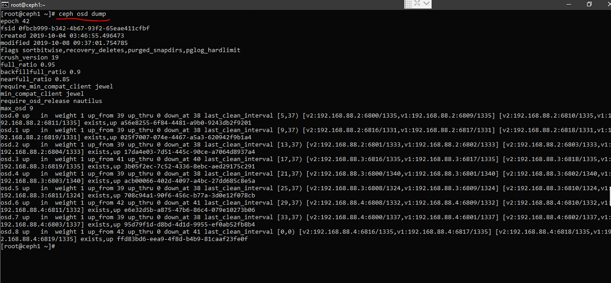

### 3.PG map
- Lệnh tạo mới một pool
` ceph osd pool create {pool-name} pg_num `

- Khi tạo pool cần chỉ rõ tham số ` pg_num ` . Ở đây có một vài giá trị thường dùng:
	- Ít hơn 5 OSDs đặt pg_num = 128
	- Từ 5 đến 10 OSDs đặt pg_num = 512
	- Từ 10 đến 50 OSDs đặt pg_num = 1024
	- Nếu nhiều hơn 50 OSDs thì phải tính toán phù hợp theo yêu cầu.
- Khi mà số lượng OSDs tăng lên, việc đặt giá trị pg_num chính xác là rất quan trọng vì nó ảnh hưởng lớn đến việc xử lý của cluster cũng như đảm bảo 
dữ liệu an toàn khi có lỗi gì đó xảy ra.

#### Placement group được sử dụng như thế nào?
- Placement group (PG) tập hợp các objects trong một pool


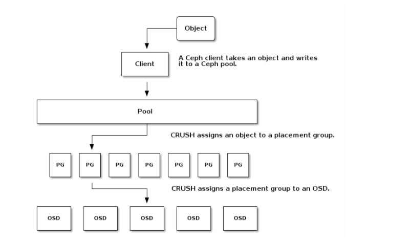

- Ceph client sẽ tính PG mà object sẽ thuộc vào. Việc tính toán này được thực hiện bằng cách băm object ID và áp dụng cho một tác vụ dựa trên số lượng PGs 
được định nghĩa trong pool và Id của pool.

- Nội dung trên trong một PG được lưu trong một bộ OSDs. Ví dụ, một pool có số replicate là 2, mỗi PG sẽ lưu các object trên 2 OSDs.


- Khi số lượng PG tăng lên, các PG mới sẽ được gán vào các OSDs. CRUSH cũng sẽ thay đổi và một số object từ PGs cũ sẽ được sao chép tới PG mới và xóa từ PG 
cũ.

- Sau khi một OSD gặp sự cố, nguy cơ mất dữ liệu tăng lên cho đến khi dữ được chứa trong osd đó được khôi phục lại toàn bộ. Một số kịch bản gây ra mất dữ 
liệu vĩnh viễn trong một PG:
	
	- OSD hư hỏng và toàn bộ bản sao của object mà osd chứa bị mất. Với tất cả các object có bản sao ở trong osd đều bị giảm từ 3 xuống 2.
	- Ceph bắt đầu khôi phục OSD này bằng cách chọn một osd mới để tạo lại bản copy thứ 3 của tất cả các object đó.
	- Một OSD khác, trong cùng PG đó, hỏng trước khi OSD mới sao chép toàn bộ copy thứ 3. Một số object chỉ còn lại một bản sao.
	- Ceph chọn một OSD khác và giữ các đối tượng sao chép để khôi phục số lượng bản sao mong muốn
	- Một OSD thứ 3, trong cùng PG này, hỏng trước khi khôi phục hoàn thành. Nếu OSD này chứa bản sao duy nhất còn lại của object thì object đó bị mất hoàn toàn.
- Trong cluster chứa 10 OSDs với 512 PG và 3 bản sao, CRUSH sẽ cho mỗi PG 3 OSDs. Như vậy mỗi OSD sẽ phải chứa lên đến (512*3)/10 = ~150 PGs. Khi OSD
đầu tiên hỏng, ceph sẽ phải khôi phục tất cả 150 PG cùng lúc.

- 150 PGs được phục hồi có thể lan ra 9 OSD còn lại. Mỗi OSD còn lại gửi bản sao của objects tới tất cả OSD khác và cũng nhận các objects mới bởi vì chúng trở 
thành một phần của PG mới.

- Lượng thời gian để khôi phục hoàn toàn phụ thuộc vào kiến trúc của cluster.

#### Cách tính số PG.

- PG là rất quan trọng, ảnh hưởng đến hiệu năng cũng như độ an toàn của dữ liệu.

- Công thức tính số PG cho mỗi pool như sau:


- pool size là số lượng replicate cho pool hoặc K + M cho erasure coded pools.
- Ví dụ về một PG map


### 4. CRUSH map

- Hệ thống lưu trữ sẽ phải lưu phần data và metadata của nó. Metadata, là dữ liệu của dữ liệu, lưu thông tin như nơi data được lưu trong chuỗi các node 
storage và các disk. Mỗi lần dữ liệu mới được thêm vào, metadata của nó sẽ được cập nhật trước khi dữ liệu được lưu. Việc quản lý metadata rất phức tạp và 
khó khăn khi dữ liệu lớn.
- Ceph sử dụng thuật toán ` Controlled Replication Under Scalable Hashing (CRUSH) ` để thực hiện lưu trữ và quản lý dữ liệu.
- Thuật toán CRUSH dùng để tính toán nơi dữ liệu sẽ được lưu hoặc nơi dữ liệu sẽ được đọc. Thay vì lưu trữ metadata, CRUSH tính metadata dự trên yêu cầu
- CRUSH tính metadata chỉ khi có yêu cầu. Quá trình tính toán này được biết với tên gọi CRUSH lookup.
- Với yêu cầu đọc và ghi, đầu tiên client liên hệ với monitor và tìm một bản copy của cluster map. Cluster map giúp client biết trạng thái và cấu hình của 
cluster. Data sẽ được biến đổi thành các objects. Sau đó object sẽ được băm với số PG để sinh ra một PG không thay đổi trong ceph pool. Sau khi tính xong PG,
CRUSH lookup xác định primary OSD để lưu và tìm kiếm data. ID của OSD primary được gửi cho client, client sẽ làm việc trực tiếp với OSD để lưu dữ liệu. Tất 
cả các thao tác tính toán đều được thực hiện bởi client, do đó không ảnh hưởng đến hiệu năng của cluster.

- Một khi data dược ghi lên primary OSD, trên cùng node đó thực hiện một tác vụ CRUSH lookup và tính vị trí secondary PG và các OSD, nơi mà data sẽ được sao 
chép.

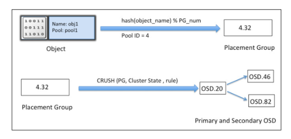

#### Cấu trúc phân cấp của CRUSH

- CRUSH là cơ sở để hiểu ceph và hoàn toàn có khả năng cấu hình; nó duy trì một phân cấp lồng nhau cho tất cả các thành phần của cơ sở hạ tầng của bạn. 
Danh sách các thiết bị CRUSH thường gồm có disk, node, rack, row, switch, dòng điện, room, data center, etc. Những thành phần này được gọi là failure zones 
hoặc CRUSH buckets.

- CRUSH map chứ danh sách các buckets để tập hợp các thiết bị vào trong vị trí vật lý. Và một danh sách các rule để cho CRUSH biết cách sao chép data cho 
các ceph pool khác nhau. Hình sau sẽ mô tả tổng quan về CRUSH map.

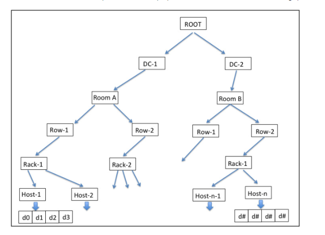

- Lấy ra CRUSH map bằng các lệnh sau:

```
ceph osd getcrushmap -o crushmap.bin
crushtool -d crushmap.bin -o crushmap.txt
```
- ` crushmap.bin ` là tên file, file này chứa crush map ở dạng nhị phân. Để đọc được file này, crushtool chuyển từ nhị phân sang dạng file text.
- Ví dụ nội dung một crush map như sau:

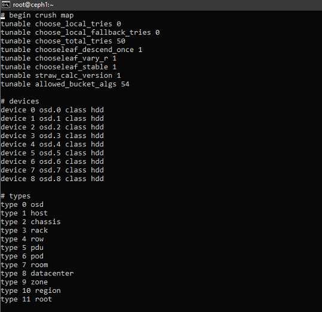

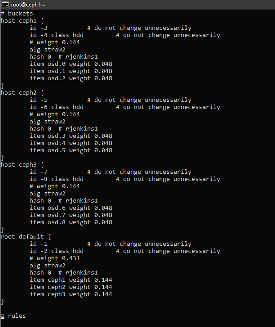


- CRUSH map có các section như sau:
	
	- ` tunables ` : Cấu hình thuật toán CRUSH
	- ` Devices `: là các OSD daemon riêng lẻ. Các thiết bị được định danh với ID là số nguyên không âm và tên có định dạng osd.N, N là id của osd. 
	Device cũng có thể chứa một lớp các thiết bị liên quan (ví dụ hdd, ssd) thuận tiện cho đặt các rules.
	- ` type và buckets `: buckets là thuật ngữ trong CRUSH để chỉ hệ thống phân cấp trong các node: hosts, racks, rows, etc. CRUSH map định nghĩa một
	 loạt các types được sử dụng để miêu tả các node này. Mặc định có các type: osd (or device), host, chassis, rack, row, pdu, pod, room, datacenter, 
	region, root. Đa số các cluster sử dụng các type này. Type có thể được định nghĩa nếu cần thiết. Hình dung bucket như cấu trúc cây. Các device là 
	các osd ở nút lá, bắt đầu bằng root. ví dụ:

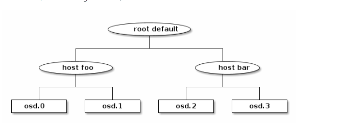

- Mỗi node (device hoặc bucket) có một trọng số ` weight ` , chỉ ra tỉ lệ tương đối của tổng dữ liệu mà các device hoặc subtree sẽ lưu. Weight được đặt ở lá, 
chỉ ra kích thước của device, và tự động tổng hợp cây từ đó, sao cho trọng lượng của nút mặc định sẽ là tổng của tất cả các thiết bị chứa bên dưới nó. 
Thông thường trọng lượng được tính bằng đơn vị terabyte (TB).

	- ` rules `: Định nghĩa chính sách mà dữ liệu được phân tán trên các thiết bị. Trong ví dụ trên có một rule là replicated_ruleset. Các rule có thể xem 
	được bằng CLI

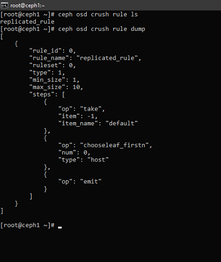

