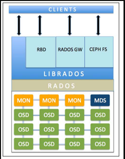
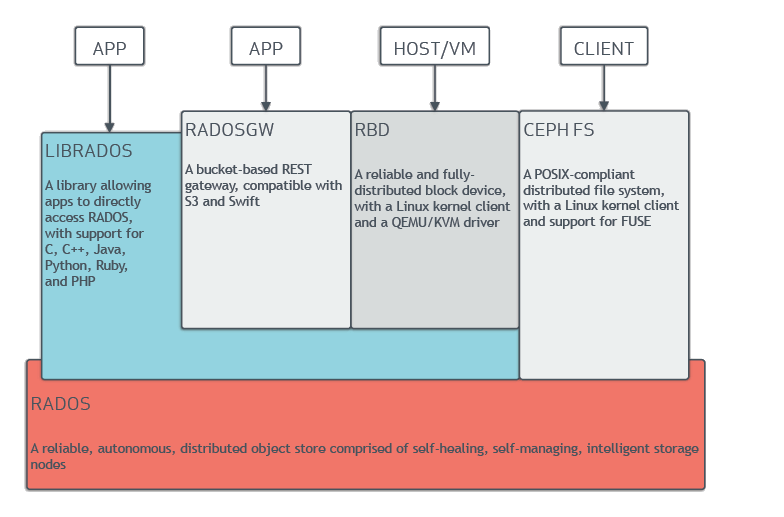
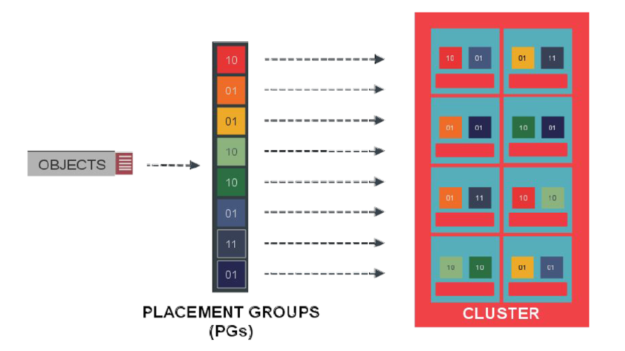
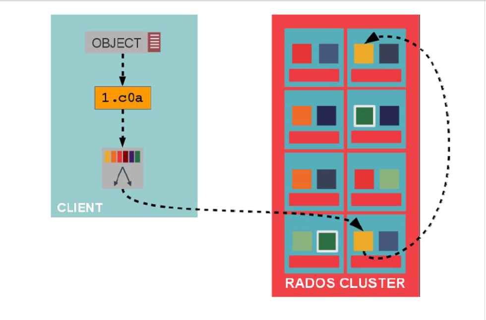
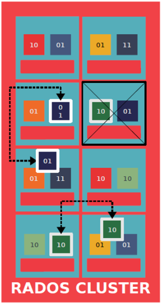

### A. Tổng quan về CEPH

> CEPH là giải pháp mã nguồn mở để xây dựng hạ tầng lưu trữ phân tán, độ tin cậy và hiệu năng cao, dễ dàng mở rộng khi cần thiết.

- Đối với hệ thống lưu trữ được điều khiến bằng phần mềm (software defined ), Ceph cung cấp giải pháp lưu trữ theo đối tượng(Object), 
khối(Block) và tập dữ liệu (file) trong cùng một nền tảng.
- CEPH chạy trên nền tảng điện toán đám mây , hỗ trợ đa dạng các loại nền tảng phần cứng , dễ dàng sử dụng với nhân LINUX và tối ưu 
chi phí triển khai.
- CEPH được sử dụng để thay thế việc lưu trữ dữ liệu trên các máy chủ , sao lưu dữ liệu,tạo ra một khu vực lưu trữ dữ liệu an toàn ,cho phép 
triển khai các dịch vụ HA( highavailibility ).

#### Các ưu điểm nổi bât của CEPH giải quyết các bài toán thực tế.

- Sử dụng thay thế lưu trữ trên ổ đĩa server thông thường
- Sử dụng để backup , lưu trữ an toàn.
- Sử dụng để triển khai các dịch vụ HA ( high availibility )
- Xây dựng giải quyết bài toán lưu trữ cho dịch vụ Cloud hoặc phát triển lên Cloud Storage( Data as a Service)
- Giải quyết vấn đề "single point of failure "
- Khả năng mở rộng khi có nhu cầu , tương tích với nhiều phần cứng khác nhau.

### B. Công nghệ CEPH 

*Hệ thống lưu trữ dựa trên đối tượng cho dữ liệu phi cấu trúc*

- CEPH cung cấp 3 loại hình lưu trữ : Object storage , Block storage và File storage
- Các server cài CEPH sẽ kết nối với nhau tạo thành Cluster
- Object storage và Block storage thường hay được sử dụng trong việc lưu trữ điện toán đám mây
- Trên mỗi server sẽ được cài CEPH , Linux và phần cứng theo server.
	- Khuyến cáo về cấu hình phần cứng : CPU 1 GHZ , RAM 2GB trên mỗi OSD để đáp ứng cho môi trường Cluster và khả năn chịu lỗi của cluster.
- Dữ liệu phi cấu trúc (định tính) : Không có mô hình lưu trữ dữ liệu được xác định trước hoặc không được tổ trức theo cách xác định được trước.
Thường các dữ liệu này sẽ là hình ảnh hay văn bản .........
- Dữ liệu có cấu trúc ( Định lượng) : Dữ liệu được tổ chức và phân chia theo một loại cấu trúc xác định từ trước.

### C. Kiến trúc CEPH 

- **Object Storage Device (OSD)** : Thành phần duy nhất trong CEPH cluster có nhiệm vụ lưu trữ và lấy lại dữ liệu dưới dạng Object .Thông thường 
thì mỗi ổ cứng vật lý sẽ cần một OSD daemon.
- **Ceph monitors (MONs)** : Theo dõi toàn bộ trạng thái của cluster bằng cách thiết lập một cluster map bao gồm OSD , MON ,PG , CRUSH và MDS map .
Tất cả các node trong cluster sẽ gửi thông tin thay đổi trạng thái về cho Monitors node.
- **Metadata Server (MDS)** : Theo dõi cấu trúc file và lưu trữ metadata , chỉ dành riêng cho CephFS.
- **Reliable Autonomic Distributed Object Store (RADOS)** : Đây là nền tảng của cụm lưu trữ CEPH. Mọi thứ trong CEPH đều được lưu dưới dạng Object,
RADOS sẽ chịu trách nhiệm lưu trữ các Object này. Để đảm bảo yêu cầu đồng bộ dữ liệu , CEPH thực hiện sao chép , phát hiện lỗi và khôi phục dữ liệu cũng
như cân bằng tải các node trên cluster.
- **Librados**: Thư viện cung cấp các cách có thể truy cập vào RADOS. Thư viện hỗ trợ các ngôn ngữ lập trình phổ biến như Ruby , PHP , Java , Phython ,
C và C++ . Thư viện cung cấp sẵn các interface giao tiếp với (RDB , RGW , POSIX ) . Thư viện API này hỗ trợ truy cập trực tiếp vào RADOS và cho phép tạo
ra các interface của riêng mình .
- **Ceph Block Device hay RADOS block device (RBD)** : Cung cấp các giải pháp lưu trữ Block storage , có khả năng mapped ,formated và mounted như một ổ 
đĩa tới server . RDB được trang bị các tinh năng lưu trữ doanh nghiệp như thin provisioning và snapshot.
- **Ceph Object Gateway hay RADOS gateway (RGW)** : Cung cấp RESTful API interface tương thích với Amazon S3 ( Simple Storage Service ) và OpenStack Object 
Storage API ( Swift ).RGW cũng hỗ trợ xác thực OpenStack keystone .
- **Ceph File System (CephFS)** : Cung cấp một hệ thống phân tán với POSIX có kích thước bất kì . CEPHFS dựa vào CEPH MDS để theo dõi hệ thống cấp bậc của
nó , đó là metadata.

### D. Cơ chế phân tán dữ liệu

- Khi có một yêu cầu ghi dữ liệu (object), hệ thống xác định object sẽ được lưu trong PG nào. Từ đó biết được vị trí chính xác object sẽ được lưu trên osd nào.
- Object sẽ được chia ra part. Các part sẽ được lưu trên các osd khác nhau.
- Ví dụ có một object cần lưu trữ. Nó sẽ bị cắt ra 8 part và mỗi part sẽ được replicate 2 lần.

### E. Cơ chế nhân bản dữ liệu 

- Các raplica của một object sẽ được chia ra làm 2 loại: primary object và secondary object.
- Object được lưu trên osd đầu sẽ được xem là primary object.
- Sau khi primary object lưu thành công, osd daemon sẽ tự động replicate object đó sang một osd khác. Bản sao của primary object sẽ được coi là secondary object.
- Việc replicate sẽ sử dụng một mạng chuyên dụng.

### F. Cơ chế phục hồi dữ liệu 

- Một OSD được xác nhận là down, dữ liệu được lưu trên osd đó cũng bị mất.
- CRUSH xác định osd khác để khôi phục dữ liệu.
- Tất cả các OSD chứa bản sao của PG trên OSD lỗi cùng tham gia vào quá trình phục hồi
- Hình sau mô tả một osd bị sự cố. Trên osd đó chứa 2 mảnh dữ liệu là 10 và 01. 2 osd khác chứa replica của 2 mảnh dữ liệu này cũng sẽ tham gia vào quá 
trình khôi phục.

 

