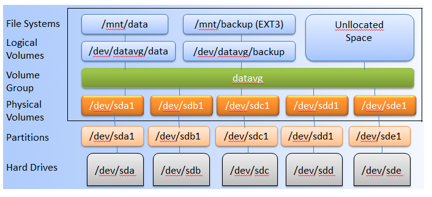
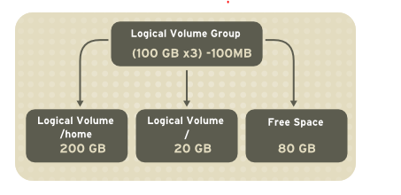
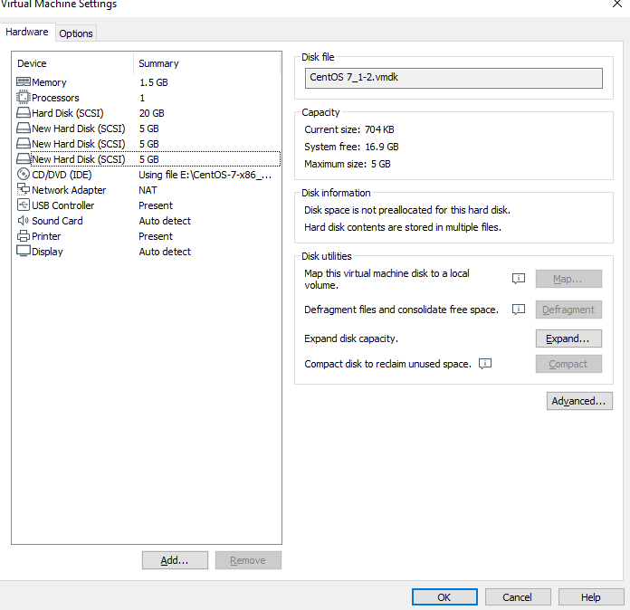
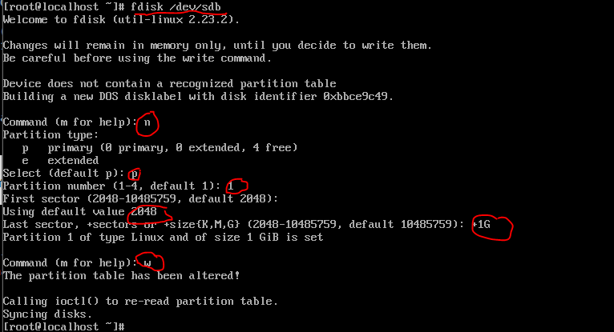
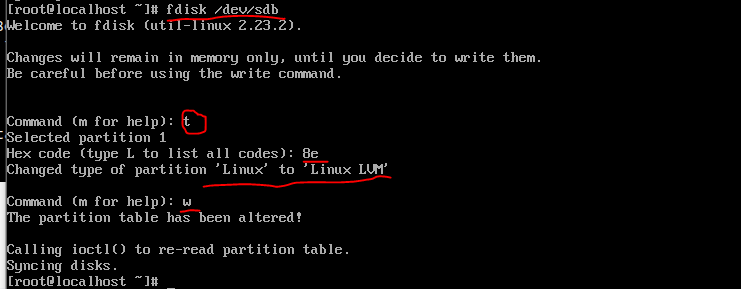
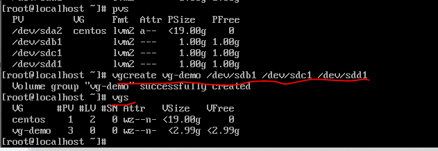

### 1. Giới thiệu về LVM (Logic Volume Manager)
> LVM là công cụ quản lý phân vùng logic được tạo và phân bổ từ các ổ đĩa vật lý . Với LVM có thể dễ dàng tạo mới , thay đổi kích thước hoặc 
xóa bỏ phân vùng đã tạo trước đó.

#### LVM được sử dụng cho các mục đích sau: 
- Tạo một hoặc nhiều phân vùng logic với toàn bộ đĩa cứng (Hơi giống RAID 0 nhưng tương tự như JBOD) , cho phép thay đổi kích thước volume.
- Quản lý trang trại đĩa cứng lớn ( Large hard disk farms ) bằng cách cho phép thêm và thay thế đĩa mà không bị gián đoạn hoạt động dịch vụ ,
kết hợp với trao đổi nóng (hot swapping).
- Trên các hệ thống nhỏ ( máy tính cá nhân ) thay vì ước tính thời gian cài đặt , phân vùng cần lớn đến mức nào , LVM cho phép hệ thống tệp 
dễ dàng thay dổi kích thước khi cần.
- Thực hiện sao lưu nhất quán bằng cách tạo Snapshot nhanh các khối một cách hợp lý.
- Mã hóa nhiều phân vùng vật lý bằng mật khẩu.

### 2. Ưu nhược điểm của LVM
#### 2.1 Ưu điểm LVM 
- Tăng tính linh hoạt và khả năng kiểm soát
	- Không để hệ thống bị gián đoạn hoạt động
	- Không làm ngừng hỏng dịch vụ
	- Có thể kết hợp với Hot Swapping ( thao tác thay thế nóng " nhanh" các thành phần bên trong máy tính)
#### 2.2 Nhược điểm LVM
- Các bước thiết lập và cài đặt phức tạp hơn
- Càng nhiều đĩa cứng và thiết lập càng nhiều thì hệ thống khởi động càng lâu
- Khả năng mất dữ liệu cao khi một trong các ổ cứng bị hỏng 
- Windows không thể nhận ra được vùng dữ liệu của LVM . Nếu cài song song(Dual-boot), Windows sẽ không thể truy cập dữ liệu trong LVM

### 3. Mô hình LVM (Logic Volume Manager).

#### 3.1 Hard Drives
- Thiết bị lưu trữ dữ liệu (các ổ cứng).
#### 3.2 Partitions
- Các phân vùng của Hard Drives , mỗi Hard Drives có 4 partitions , trong đó partitions bao gồm 2 loại là Primary partition và extended partition
	- Primary partition : Phân vùng chính, có thể khởi động . Mỗi đĩa cứng có thể có tối đa 4 phân vùng này.
	- Extended partition : Phân vùng mở rộng , có thể tạo những vùng luân lý .
#### 3.3 Physical Volumes
- Một cách gọi khác của Partition trong kỹ thuật LVM , nó là những thành phần cơ bản được dùng trong LVM . Một Physical Volume không thể mở rộng
ra ngoài khả năng của ổ đĩa. Hiểu đơn giản thì một ổ đĩa có thể phân chia thành nhiều partition và được gọi là Physical Volume.
#### 3.4 Volume Group
- Một nhóm bao gồm nhiều Physical Volume trên một hoặc nhiều ổ đĩa khác nhau kết hợp lại thành Volume Group

#### 3.5 Logical Volume 
- Một Volume Group được chia nhỏ thành các Logical Volume. Nó dùng để mount tới hệ thống tập tin (File system) và được format với những chuẩn 
định dạng khác nhau như ext2, ext3,ext4...

#### 3.6 File Systems
- Hệ thống tập tin quản lý các file và thư mục trên ổ đĩa , được mount tới các Logic Volume trong mô hình LVM .

### 4. Thao tác với LVM trên VM
#### 4.1 ADD thêm ổ cứng vào máy ảo .

#### 4.2 Tạo Logical Volume trên LVM 
#### 4.2.1 Kiểm tra các Hard Drives có trong hệ thống
- Kiểm tra các Hard Drives có trong hệ thống bằng câu lệnh: ` lsblk`

#### 4.2.2 Tạo Partition
- Sử dụng câu lệnh : ` fdisk /dev/sdb ` để tạo partition cho hard drives mới tạo ra sdb.

Trong đó bạn chọn `n` để bắt đầu tạo partition

Bạn chọn `p` để tạo partition primary

Bạn chọn `1` để tạo partition primary 1

Tại First sector (2048-20971519, default 2048) bạn để mặc định

Tại Last sector, +sectors or +size{K,M,G} (2048-20971519, default 20971519) bạn chọn `+1G `để partition bạn tạo ra có dung lượng 1 G

Bạn chọn `w` để lưu lại và thoát.

Tiếp đó , thay đổi định dạng của Partition vừa mới tạo thành LVM:

Bạn chọn `t` để thay đổi định dạng partition
Bạn chọn `8e` để đổi thành LVM

#### 4.2.3 Tạo Physical Volume
- Ta sử dụng lệnh ` pvcreate `theo cú pháp:
` pvcreate /dev/tên_phân_vùng (partition đã được chia ở trên) `

#### 4.2.4 Tạo Volume Group
- Ta sử dụng lệnh `vgcreate` theo cú pháp :
`vgceate tên_group /dev/phan_vung1 /dev/phan_vung2 /dev/phan_vung3 `
- Dùng lệnh ` vgs` để kiểm tra các Volume group

#### 4.2.5 Tạo Logical Volume
- Ta sử dụng lệnh `lvcreate` theo cú pháp
` lvcreate -L size_volume -n tên_logic_volume tên_group_volume `

size_volume : là giá trị dung lượng của Logic volume (thường tính bằng đơn vị G).

L: Chỉ ra dung lượng của logical volume

n: Chỉ ra tên của logical volume

- Để kiểm tra các Logical Volume ta dùng lệnh ` lvs` 

#### 4.2.6 Định dạng Logical Volume 
- Để format các logical Volume thành các định dạng như xfs , ext3 , ext4 ta dùng lệnh sau:
` mkfs -t ext4 /dev/ten_volume_group/tên_logical_volume)

#### 4.2.7 Mount và sử dụng 
- Tạo thư mục để mount Logical Volume vào thư mực đó.
` mkdir lvmdemo`
- Ta mount logical volume vừa tạo ở trên vào thư mục
` mount /dev/tên_volume_group/tên_Logical_volume tên_thư_mục_chứa `

- Kiểm tra dung lượng các thư mục được đã được mount: 
` df -h` 

### 4.3 Thay đổi dung lượng Physical Volume 
- Trước khi thay đổi dung lượng Physical Volume ta cần kiểm tra Volume Group có đủ dung lượng cho Logical Volume sử dụng
hay không . Ta thực kiểm tra dung lượng   `vgs` , `lvs` , `pvs` trước rồi thực hiện câu lệnh: 
` vgdisplay `

#### 4.3.1 Tăng kích thước Logical Volume 
- Ta dùng lệnh : ` lvextend -L +size /dev/vg_name/lv_name `
- -L +size  là dung lượng mở rộng thêm cho Logic Volume ( ví dụ -L +500M )

- Tới đây kích thước của Logical Volume đã được tăng nhưng filesystem vẫn chưa được up date. Ta thực hiện thay đổi filesystem
bằng câu lệnh sau :
` resize2fs /dev/vg_name/lv_name `

#### 4.3.2 Giảm kích thước Logical Volume
- Để giảm kích thước của Logical  Volume , trước hết phải unmount Logical Volume mình muốn giảm 
` umount /dev/vg_name/lv_name `
- Sau đó giảm kích thước của Logical Volume về bằng `size` bằng câu lệnh 
` lvreduce -L size /dev/vg_name/lv_name `
- Định dạng lại file system dùng lệnh
` mkfs -t ext4 /dev/vg_name/lv_name` 

- Cuối cùng mount lại Logical Volume 
` mount /dev/vg-name/lv-name name_mountfile `

#### 4.4 Thay đổi dung lượng trên Volume Group
- Thêm một partition vào Volume Group ta dùng lệnh: 
` vgextend dev/vg-name /dev/partition_name `
- Để cắt môt partition khỏi Volume Group ta dùng lệnh:
` vgreduce /dev/vg-name /dev/partition_name `

#### 4.5 Xóa Logical Volume , Volume Group ,Physical Volume 
#### 4.5.1 Xóa Logical Volume
- Trước tiên ta phải Umount Logical Volume
`umount /dev/vg-name/lv-name `
- Sau dó tiến hành xóa Logical Volume bằng câu lệnh
`lvremove /dev/vg-name/lv-name `

#### 4.5.2 Xóa Volume Group
- Trước khi xóa Volume Group thì phải xóa Logical Volume trước
- Sau đó xóa Volume Group bằng câu lệnh
` vgremove /dev/vg-name `

#### 4.5.3 Xóa Physical Volume 
- Xóa Physical Volume ta dùng lệnh 
` pvremove /dev/sd_name`

