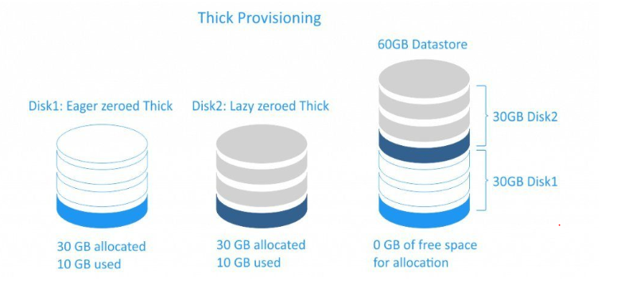
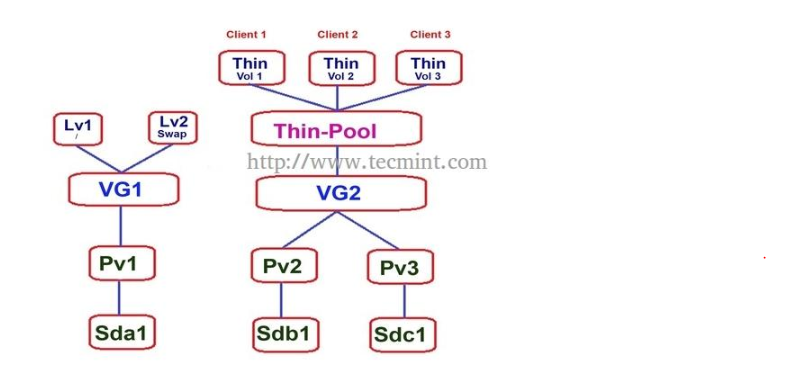
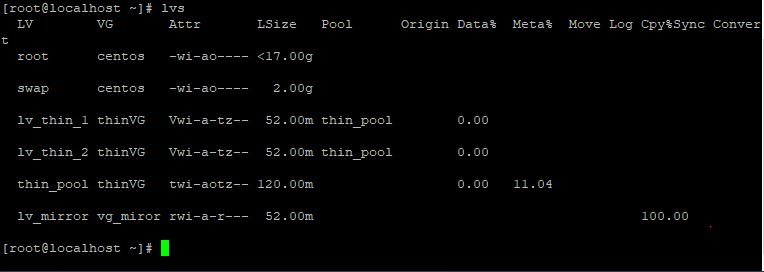
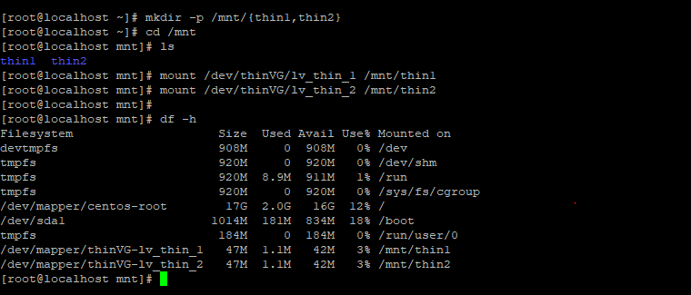

### Thick and Thin Provisioning
### A. Tổng quan về Thick Provisioning và Thin Provisioning
### 1. Thick Provisioning

> Thick Provisioning là một phân bổ lưu trữ trước . Khi ta tạo một disk ảo cho máy ảo , nó sẽ nhận nguyên dung lượng của
disk đó mặc dù nó chưa sử dụng hết dung lượng disk đó.



##### Giả sử bạn tạo VM với disk 100GB . Chọn định dạng Thick thì VM sẽ chiếm dụng đúng 100GB của server , chọn Thin thì
VM chỉ chiếm dụng đúng dung lượng mà nó đang lưu giữ.


##### Thick có 2 loại là:
- `Thick Lazy ` là nó nhận vừa đủ dung lượng disk mà ta tạo ra cho máy ảo và sẽ không xóa dữ liệu cũ trên disk. Khi chúng
ta ghi đè lên nó thì dữ liệu mới bị xóa. Chính vì vậy nên việc tao ra đĩa ảo sẽ rất nhanh nhưng sẽ mất thời gian cho lần
đầu tiên do phải xóa dữ liệu.

- ` Thick Eager ` cũng nhận toàn ộ dung lượng mà ta tạo disk cho VM và không gian bị xóa sạch mọi dữ liệu trước đó trên
phương tiện vật lý . Vì vậy khi tạo đí cho VM ở kiểu này sẽ lâu hơn só với Thick Lazy nhưng với lần ghi đầu tiên sẽ nhanh hơn.

- Sử dụng Thick Lazy và Thick Eager bị lãng phí dung lượng nhưng lại đảm bảo về sự độc lập giữa các máy ảo.

### 2. Thin Provisioning

> Thin là một lột lại chia ra trước lưu trữ , nó chỉ tiêu thụ dung lượng mà nó cần ban đầu và ấp phát theo nhu cầu về sau.
Với co chế này tránh lãng phí tài nguyên lưu trữ hơn so với Thick. Nhược điểm của cơ chế này là nếu dung lượng đĩa cứng
bị hết thì tất cả các VM trên đó sẽ gặp vấn đề vì không còn dung lượng disk sử dụng.


### B. Tính năng Thin Provisioning trong LVM.
### 1. Giới thiệu 

- Thin Provisioning là tính năng cấp phát ổ cứng dựa trên sự linh hoạt của LVM . Giả sử ta có một Volume Group ,ta sẽ
tạo ra 1 Thin Pool từ VG này với dung lượng là 120M cho nhiều khách hàng sử dụng. Giải sử có 3 khách hàng , mỗi khách
hàng được cấp 6GB dữ liệu . Như vậy tao có 3x40M là 120M



### 2. Cách cài đặt và sử dụng tính năng của Thin Provisioning
- Tạo volume group từ physical volume 


- Tạo Thin pool

` lvcreate -L 120M --thinpool thin_pool thinVG ` 

- Trong đó:
	- -L : Size của volume group
	- --thinpool : tạo thin pool
	- thin_pool : tên Thin pool
	- ThinVG : tên của VG sử dụng làm thin pool


- Tạo Thin volume:

```
lvcreate -V 50M --thin -n lv_thin_1 thinVG/thin_pool  
lvcreate -V 50M --thin -n lv_thin_2 thinVG/thin_pool

```
- Trong đó:
	- -V : kích thước của Thin Volume
	- --thin : khai báo kiểu tạo volume
	- lv_thin_1 /2 : tên của thin volume
	- thinVG/thin_pool : tên của VG và tên của thin pool tạo nên thin Volume




- Format 2 volume về định dạng ext4

```
mkfs -t ext4 /dev/thinVG/lv_thin_1
mkfs -t ext4 /dev/thinVG/lv_thin_2

```
- Tạo mount point vào Mount volume này lên hệ thống. MNT gắt kết cac thư mục hệ thống tạm thời (thư mục temporary)
noi Systemadmin có thể gắn kết các file của hệ thống

```
mkdir -p /mnt/{thin1,thin2}
mount /dev/thinVG/lv_thin_1 /mnt/thin1
mount /dev/thinVG/lv_thin_2 /mnt/thin2

```



- Mở rộng thin Pool ( về bản chất đây vẫn chỉ là một group volume) nên có thể add thêm dung lượng như một VG.

### 3. Tính năng Over Provisioning

> Khi sử dụng tính năng ` Thin Provisioning ` ta có thể cung cấp dung lương cho nhiều hơn những gì thực tế ta có khi 
storage pool hiện đang còn có dung lượng trống. Việc cung cấp như thế này gọi là ` Over Provisioning`


- Giả sử với 4GB của thinVG trên , ta có 2 LV 50MB , ta tạo ra một LV với dung lượng là 100MB (tổng không vượt quá VG)
` lvcreate -V 50M --thin -n lv_thin_3 thinVG/thin_pool `

- Định dạng Volume về dạng Ext4 và mount vào hệ thống

```
mkdir /mnt/thin3
mkfs -t ext4 /dev/thinVG/lv_thin_3
mount /dev/thinVG/lv_thin_3 /mnt/thin3

```

- Kết quả thu được là 


