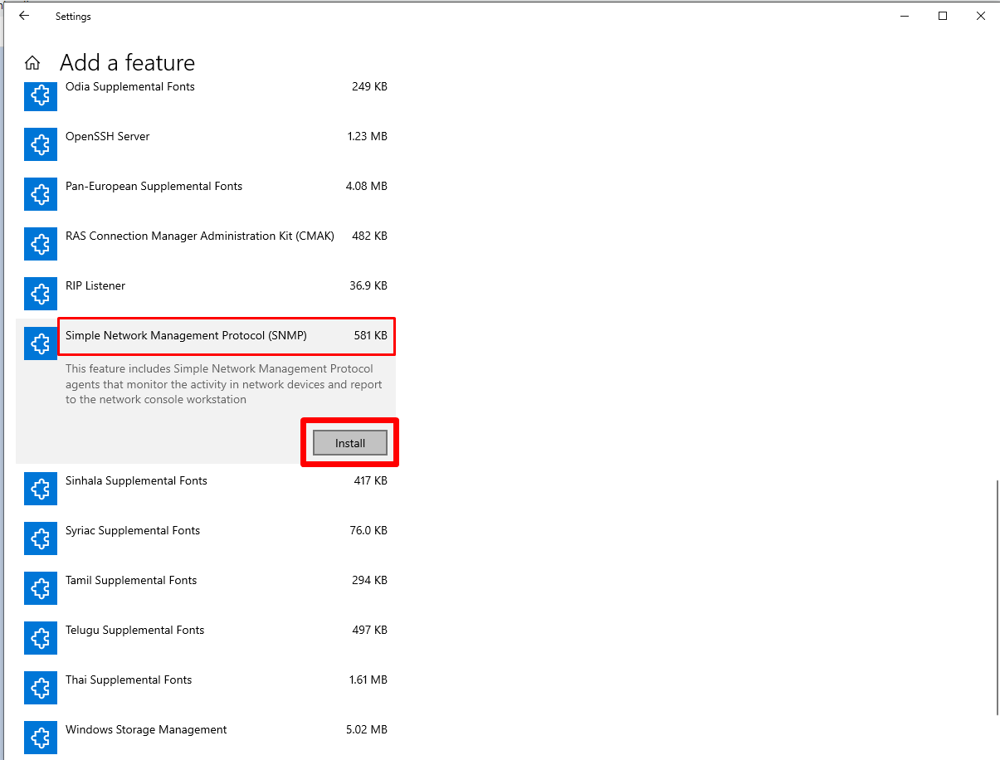
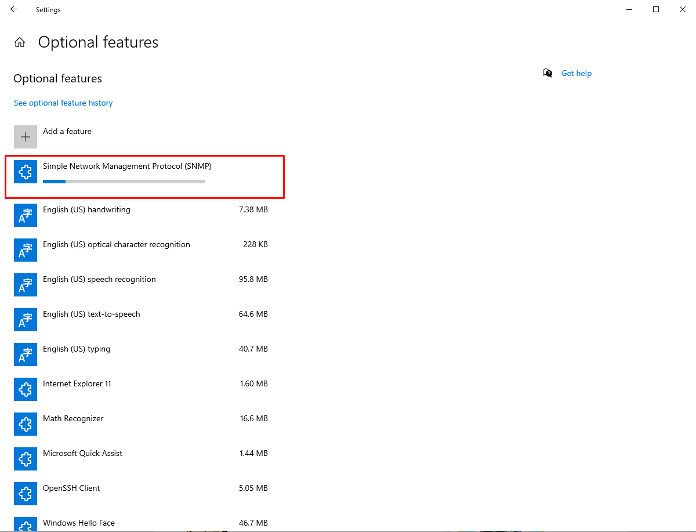
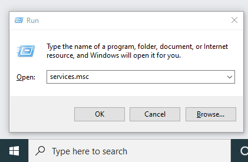
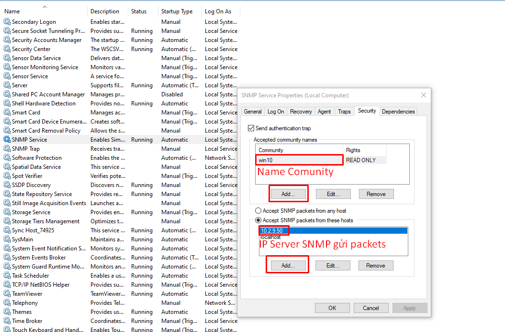
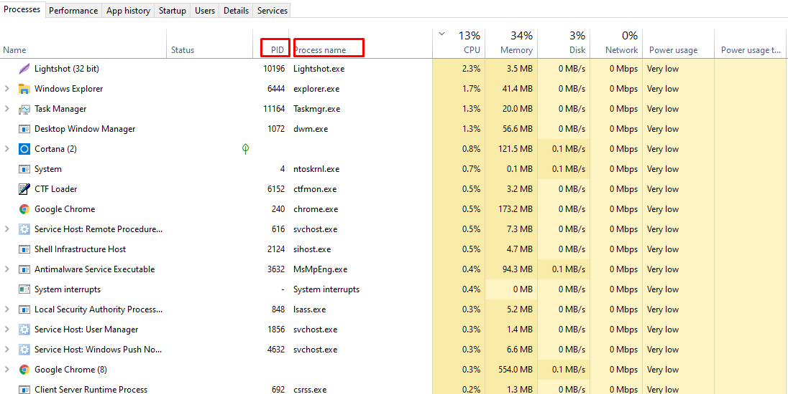

### A. Tổng quan về giao thức SNMP

### 1.Tổng quan giao thức SNMP
- SNMP còn được gọi là Simple Network Managerment Protocol, là một phần của bộ giao thức (TCP/IP). SNMP được sử dụng phổ biến trong việc giám sát và điều khiển thiết bị mạng như Switch , router , server ....
- Một số bài toán thực tế sử dụng SNMP : 
	- Giám sát tài nguyên máy chủ
	- Giám sát lưu lượng trên port của switch , router
	- Cảnh báo sự cố tức thời (down port, login fail , ....)

### 2. Các key_word trong SNMP
- 1. SNMP Agent : Là các thiết bị , máy tính hoặc cá phần mềm tương thích SNMP và được quản lý bởi SNMP Management
- 2. SNMP Management : Giám sát và điều khiển tầm trung các thông tin từ các Agent
- 3. Object ID : Mỗi thiets bị hỗ trợ SNMP có thể cung cấp nhiều thông tin , mỗi thông tin đó được gọi là một object tương ứng với OID
- 4. Object access : Mỗi Object có quyền Read_only hoặc Read_write
- 5. Management Information Base (MIB ) : Cấu trúc dữ liệu gồm các đối tượng được quản lý

### 3. Các phương thức của SNMP
- 1. GetRequest : Manager gửi GetRequest cho agent để yêu cầu agent cung cấp thông tin nào đó dựa vào ObjectID
- 2. GetNexRequest : Manager gửi GetNextRequest có chứa một ObjectID cho Agent và yêu cầu Agent cung cấp thông tin nằm kế tiếp ObjectID đó trong MIB
- 3. SetRequest : Manager gửi SetRequest cho Agent để dặt giá trị cho đối tượng của Agent dựa vào ObjectID
- 4. GetReponse : Agent gửi GetRequest cho Manager để trả lời khi nhận được GetRequest/GetNextRequest
- 5. Trap : Agent tự động gửi Trap cho Manager khi có một sự kiện xảy ra đối với một Object nào đó trong Agent


### B. SNMPWALK
### 1. Tổng quan SNMPWALK 
- SNMPWALK là một ứng dụng của SNMP(simple network management protocol) có trên CLI của SMS ( security management system ) và sử dụng SNMP GetNextRequest để truy vấn thông tin thiết bị mạng


### 2. Command
```
C:\Users\ITA\Downloads\SnmpWalk.exe SnmpWalk.exe [-q] -r:host [-p:port] [-t:timeout] [-v:version] [-c:community]
        [-ei:engine_id] [-sn:sec_name] [-ap:auth_proto] [-aw:auth_passwd]
        [-pp:priv_proto] [-pw:priv_passwd] [-ce:cont_engine] [-cn:cont_name]
                [-os:start_oid] [-op:stop_oid] [-csv]

- C:\Users\ITA\Downloads\SnmpWalk.exe : Đường dẫn chứa file SnmpWalk.exe
- q : Chỉ in giá trị biến , bỏ qua phần tiêu đề
- r : Name hoặc IP của host remote
- p : port
- t : thời gian timeout , mặc định là 5s
- v : version , mặc định là 1
- c : mặc định là public
- ei : Engine ID : Định dạng thập lục phân (SNMPv3)
- sn : Sec_name ,security name SNMPv3
- ap : authen_application : MD5 , SHA (SNMPv3)
- aw : authen_password
- pp : privaci_protocol : giao thức bảo mật DÉ , AES128/192/256 , 3DES (SNMPv3)
- os : OID fist start , mặc định là 1
- op : OID stop 
- csv : output định dạng csv
```

### 3. Install snmpwalk on windowns
https://www.softpedia.com/get/Network-Tools/Misc-Networking-Tools/SnmpWalk.shtml

### 4. Install snmpwalk on linux
```
yum install net-snmp-utils

```

### C. Sử dụng snmpwalk trên linux để lấy thông tin system win10
### 1. Cài đặt snmpwalk trên linux
```
yum install net-snmp-utils

```

### 2. Thực hiện thao tác trên windowns








- Truy cập cài đặt Snmp trong service







### 3. Kiểm tra PID của process trong taskmanagement




### 4. Xem thông tin về PID hoặc Disk-Space
> Thực hiện " thủ công " lưu các thông tin vào file rồi đọc thông số trong đó


```
snmpwalk -v 2c 10.1.20.74 -c win10 > 3.txt

- -v 2c : sử dụng phiên phải v2c
- 10.1.20.74 : IP của Windows Agent
- win10 : Name Community cài đặt ở trong service của windows
- 3.txt : File sẽ lưu thông tin lại 
```


- Kiểm tra PID
	- Search trong file 3.txt PID hoặc Name_process.ext


- Kiểm tra Disk-Space
	- Tìm ` HOST-RESOURCES-MIB::hrStorage` 
	- Tính dung lượng của vùng nhớ đơn vị bytes : Số Interger * Giá trị của Interger (4096/65536) 


- Script sử dụng SNMP check thông số kỹ thuật hệ thống
```
#!/usr/bin/perl
# Enhanced by: Dan Capper
# Date: 13/11/2007
# Based on original script:
# Author : jakubowski Benjamin
# Date : 19/12/2005
# check_win_snmp_disk.pl SERVEUR COMMUNITY

# ------------ "Nearest" routines (round to a multiple of any number)
# Copied from Math::Round on cpan.org
# Math::Round was written by Geoffrey Rommel GROMMEL@cpan.org in October 2000.

sub nearest {
 my ($targ, @inputs) = @_;
 my @res = ();
 my $x;

 $targ = abs($targ) if $targ < 0;
 foreach $x (@inputs) {
   if ($x >= 0) {
      push @res, $targ * int(($x + $half * $targ) / $targ);
   } else {
      push @res, $targ * POSIX::ceil(($x - $half * $targ) / $targ);
   }
 }
 return (wantarray) ? @res : $res[0];
}

$STATE_OK = 0;
$STATE_WARNING = 1; 
$STATE_CRITICAL = 2;
$STATE_ERROR = 255;

# IEC Multipliers
$TEBI = 1099511627776;
$GIBI = 1073741824;
$MEBI = 1048576;
$KIBI = 1024;

if ($#ARGV + 1 < 5) {
	print "Enhanced check_win_snmp_disk.pl by Dan Capper based on original script by jakubowski Benjamin\n";
	print "Reports disk usage of Windows systems via snmp to nagios\n";
	print "\n";
	print "usage:\n";
	print "check_win_snmp_disk.pl [address] [community-name] [logical disk] [warn-level] [critical-level]\n";
	print "Where:\n";
	print "[address]	= ip address or name of server to check\n";
	print "[community-name] = SNMP community name with at least READ ONLY rights to server\n";
	print "[logical disk]	= Logical disk number of disk to check - on windows systems, 0 = A:, 1 = C:, 2 = D:, etc\n";
	print "[warn-level]	= Percentage full before return warning level to nagios\n";
	print "[critical-level] = Percentage full before return critical level to nagios\n";
	print "For example the command:\n";
	print "./check_win_snmp_disk.pl 10.0.0.10 public 2 80 90\n";
	print "Will check disk 'C:' on the server at '10.0.0.10' using snmp community name 'public'. Warn at 80% full, Critical at 90% full\n";
	exit $STATE_ERROR;
}

if (@ARGV[0] =~ m/((\d{1,3}\.){3}\d{1,3})|(\w+)/) {
	$SERVER = @ARGV[0];
} else {
	print "ERROR: address argument not in correct format\n";
	print "Execute with no parameters to see usage information\n";
	exit $STATE_ERROR;
}

if (@ARGV[1] =~ m/\w+/) {
	$COMMUNITYNAME=@ARGV[1];
} else {
	print "ERROR: community-name argument not in correct format\n";
	print "Execute with no parameters to see usage information\n";
	exit $STATE_ERROR;
}

if (@ARGV[2] =~ m/\d{1,2}/) {
	$LDISK=@ARGV[2];
} else {
	print "ERROR: logical disk argument not in correct format\n";
	print "Execute with no parameters to see usage information\n";
	exit $STATE_ERROR;
}

if (@ARGV[4] =~ m/\d{1,3}/ and @ARGV[4] <= 100) {
	$CRITICAL=@ARGV[4];	
} else {
	print "ERROR: critical argument not in correct format\n";
	print "critical level must no more than 100\n";
	print "Execute with no parameters to see usage information\n";
	exit $STATE_ERROR;
}
 
if (@ARGV[3] =~ m/\d{1,3}/ and @ARGV[3] <= 100 and @ARGV[3] <= $CRITICAL) {
	$WARN=@ARGV[3];	
} else {
	print "ERROR: warning-level argument not in correct format\n";
	print "warning-level must no more than 100 and less than critical level\n";
	print "Execute with no parameters to see usage information\n";
	exit $STATE_ERROR;
}

# Used Space
$RAWUSED=`snmpget -v 1 $SERVER -c $COMMUNITYNAME .iso.org.dod.internet.mgmt.mib-2.host.hrStorage.hrStorageTable.hrStorageEntry.hrStorageUsed.$LDISK -t 5| awk '{ print \$4 }'`;
$RAWUSED =~ s/\n//g;
if ($RAWUSED !~ m/\d+/) {
	print "ERROR : Unexpected result from snmpget\n";
	exit $STATE_ERROR;
}

# Size of disk
$RAWSIZE=`/usr/bin/snmpget -v 1 $SERVER -c $COMMUNITYNAME .iso.org.dod.internet.mgmt.mib-2.host.hrStorage.hrStorageTable.hrStorageEntry.hrStorageSize.$LDISK -t 5| awk '{ print  \$4  }'`;
$RAWSIZE =~ s/\n//g;
if ($RAWSIZE !~ m/\d+/) {
	print "ERROR : Unexpected result from snmpget\n";
	exit $STATE_ERROR;
}

# GET BYTE VALUE FOR DISK SYSTEM (512;1024;2048;4096)
$VALUE=`/usr/bin/snmpget -v 1 $SERVER -c $COMMUNITYNAME .iso.org.dod.internet.mgmt.mib-2.host.hrStorage.hrStorageTable.hrStorageEntry.hrStorageAllocationUnits.$LDISK -t 5 | awk '{ print \$4 }'`;

$VALUE =~ s/\n//g;
if ($VALUE !~ m/\d+/) {
	print "ERROR : Unexpected result from snmpget\n";
	exit $STATE_ERROR;
}

# Calculate percentage used

SWITCH: {
	if ($RAWSIZE > 0)		{ $PERCENTUSED = nearest(.1, $RAWUSED/$RAWSIZE * 100); last SWITCH; };
	$PERCENTUSED = 0;
}

# Calculate human-readable total space

SWITCH: {
	if ($RAWSIZE * $VALUE >= $TEBI)		{ $TOTAL = nearest(.1, $RAWSIZE * $VALUE/($TEBI)); $TOTALUNITS = "TiB"; last SWITCH; };	
	if ($RAWSIZE * $VALUE >= $GIBI)		{ $TOTAL = nearest(.1, $RAWSIZE * $VALUE/($GIBI)); $TOTALUNITS = "GiB"; last SWITCH; };	
	if ($RAWSIZE * $VALUE >= $MEBI)		{ $TOTAL = nearest(.1, $RAWSIZE * $VALUE/($MEBI)); $TOTALUNITS = "MiB"; last SWITCH; };	
	if ($RAWSIZE * $VALUE >= $KIBI)		{ $TOTAL = nearest(.1, $RAWSIZE * $VALUE/($KIBI)); $TOTALUNITS = "KiB"; last SWITCH; };	
	if ($RAWSIZE > 0) 			{ $TOTAL = nearest(.1, $RAWTOTAL * $VALUE); $TOTALUNITS = "B"; last SWITCH; };
	$TOTAL = 0;
}

# Calculate human-readable used space

SWITCH: {
	if ($RAWUSED * $VALUE >= $TEBI)	{ $USED = nearest(.1, $RAWUSED * $VALUE/($TEBI)); $USEDUNITS = "TiB"; last SWITCH; };	
	if ($RAWUSED * $VALUE >= $GIBI)	{ $USED = nearest(.1, $RAWUSED * $VALUE/($GIBI)); $USEDUNITS = "GiB"; last SWITCH; };	
	if ($RAWUSED * $VALUE >= $MEBI)	{ $USED = nearest(.1, $RAWUSED * $VALUE/($MEBI)); $USEDUNITS = "MiB"; last SWITCH; };	
	if ($RAWUSED * $VALUE >= $KIBI)	{ $USED = nearest(.1, $RAWUSED * $VALUE/($KIBI)); $USEDUNITS = "KiB"; last SWITCH; };	
	if ($RAWUSED * $VALUE > 0) 		{ $USED = nearest(.1, $RAWUSED * $VALUE); $USEDUNITS = "B"; last SWITCH; };
	$USED = 0;
}

# Calculate Free Space

$RAWFREE=$RAWSIZE-$RAWUSED; 

# Calculate human-readable free space

SWITCH: {
	if ($RAWFREE * $VALUE >= $TEBI)	{ $FREE = nearest(.1, $RAWFREE * $VALUE/($TEBI)); $FREEUNITS = "TiB"; last SWITCH; };	
	if ($RAWFREE * $VALUE >= $GIBI)	{ $FREE = nearest(.1, $RAWFREE * $VALUE/($GIBI)); $FREEUNITS = "GiB"; last SWITCH; };	
	if ($RAWFREE * $VALUE >= $MEBI)	{ $FREE = nearest(.1, $RAWFREE * $VALUE/($MEBI)); $FREEUNITS = "MiB"; last SWITCH; };	
	if ($RAWFREE * $VALUE >= $KIBI)	{ $FREE = nearest(.1, $RAWFREE * $VALUE/($KIBI)); $FREEUNITS = "KiB"; last SWITCH; };	
	if ($RAWFREE > 0) 		{ $FREE = nearest(.1, $RAWFREE * $VALUE); $FREEUNITS = "B"; last SWITCH; };
	$FREE = 0;
}

if ( $PERCENTUSED < $WARN ) { 
	print "OK : Percent Used : $PERCENTUSED%, Total : $TOTAL $TOTALUNITS, Used : $USED $USEDUNITS,  Free : $FREE $FREEUNITS\n"; 
	exit $STATE_OK; 
}

if ( $PERCENTUSED < $CRITICAL ) { 
	print "WARNING : Percent Used : $PERCENTUSED%, Total : $TOTAL $TOTALUNITS, Used : $USED $USEDUNITS,  Free : $FREE $FREEUNITS\n"; 
	exit $STATE_WARNING;
}

if ( $PERCENTUSED >= $CRITICAL ) {
	print "CRITICAL : Percent Used : $PERCENTUSED%, Total : $TOTAL $TOTALUNITS, Used : $USED $USEDUNITS,  Free : $FREE $FREEUNITS\n"; 
	exit $STATE_CRITICAL;
}

print "ERROR : Unexpected Results : Percent Used : $PERCENTUSED%, Total : $TOTAL $TOTALUNITS, Used : $USED $USEDUNITS,  Free : $FREE $FREEUNITS\n"; 
exit $STATE_ERROR;


stat_id=`snmpwalk -v 2c -c public $ip hrStorageDescr | grep "STRING: $i" | awk '{print substr($1,36,1)}'`
        stat_unit=`snmpwalk -v 2c -c public $ip hrStorageAllocationUnits.$stat_id | awk '{print $4}'`
        stat_size=`snmpwalk -v 2c -c public $ip hrStorageSize.$stat_id | awk '{print $4}'`
        size=`expr $stat_unit \* $stat_size`
        stat_used=`snmpwalk -v 2c -c public $ip hrStorageUsed.$stat_id | awk '{print $4}'`
        used=`expr $stat_unit \* $stat_used`
        used_perc=`expr $used \* 100 \/ $size`

```
