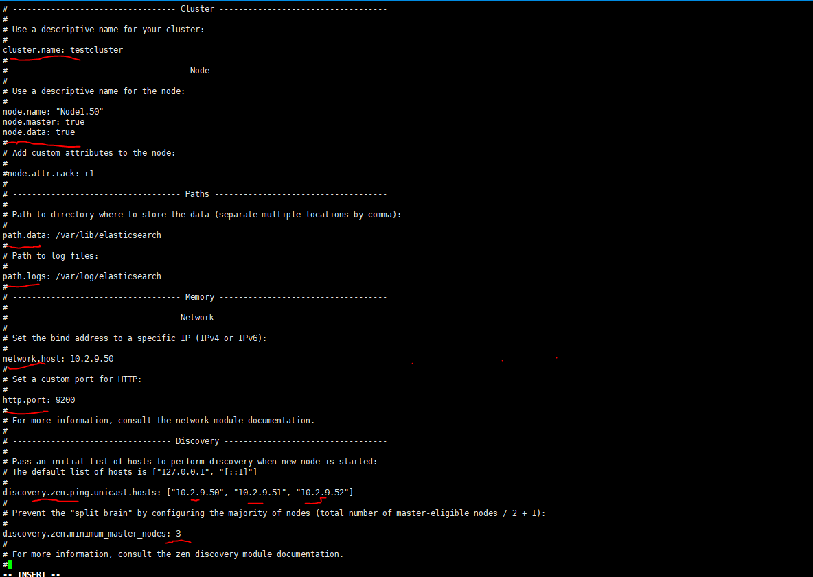

### A. Tìm hiểu về Elasticsearch 

### 1. Giới thiệu Elasticsearch
> Elasticsearch là công cụ tìm kiếm được sử dụng phổ biến nhất trong việc phân tích nhật kí , văn bản , thông tin bảo mật và phân tích nghiệp vụ cũng như thông tin vận hành. Elasticsearch là công cụ được xây dựng và phát triển trên nền
tảng mã nguồn mở , nên chúng ta có thể hoàn toàn cài đặt và sử dụng miễn phí.


### 2. Các thành phần của Elasticsearch

 

### 2.1 Document

- Đây là đơn vị lưu trữ nhỏ nhất trong elasticsearch . Đây cũng là đơn vị lưu trữ thông tin cơ bản trong Elastisearch , là một JSON object đới với một số dữ liệu.

### 2.2 Index

- Chức năng dùng để tìm kiếm gọi là Inverted Index .

### 2.3 Shard

- Shard là đối tượng nhỏ nhất , hoạt động ở mức thấp nhất nhưng đóng góp vai trò cực kì quan trọng trong việc lưu dữ liệu ở mỗi node.
- Một node có thể có một hoặc nhiều Shard
- Elasticsearch cung cấp 2 cơ chế của Shard là Primary shard và Replication shard
	- Primary được dùng để lưu trữ dữ liệu và đánh dấu Index . Mặc định mỗi Index sẽ có 5 primary và đi kèm là với nó là 1 replica , sau khi được đánh dấu ở primary thì dữ liệu sẽ chuyển sang cho replication.
	- Replication : Nơi lưu trữ bản sao của primary shard , duy trì tính toàn vẹn và tăng tốc độ tìm kiếm dữ liệu . 

### 2.4 Node 
	
- Là một đơn vị hoạt động riêng lẻ của Elasticsearch  , lưu trữ dữ liệu được nhận về và tham giá việc đánh Index của Cluster.
- Mỗi node được xác định bằng một tên riêng và không đươc phép trùng lặp

### 2.5 Cluster

- Tập hợp các node hoạt động cùng nhau , cùng chia sẻ với nhau tạo thành một Cluster

### 3. Ưu điểm của Elasticsearch 

- Có khả năng tìm kiếm và phân tích dữ liệu
- Có khả năng mở rộng theo chiều ngang
- Hỗ trợ các Elasticsearch client như Java , python , php ...

### 4 Nhược điểm của Elasticsearch 

- Elasticsearch được thiết kế với chức năng tìm kiếm , lưu trữ dữ liệu . Do đó khi sử dụng thì ta nên sử dụng kèm theo  với một DB khác như MongoDB hay Mysql
- Trong Elasticsearch không đảm bảo được toàn vẹn dữ liệu của các hoạt động như Insert , Update hay Delete.
- Không thích hợp với hệ thống thường xuyên cập nhật dữ liệu . Sẽ rất tốn kém cho việc đánh Index dữ liệu.

### B. Hướng dẫn cấu hình tạo Cluster

### 1. Mô hình triển khai
- Tạo 2 node client cài đặt Elasticsearch 
	- 1 node : 10.2.9.51
	- 1 node : 10.2.9.52
 
- Một server sử dụng cài đặt ELK stack	
	- IP : 10.2.9.50


### 2. Cài đặt Elasticsearch trên 2 node client

- Disable IPv6

```

cat > /etc/sysctl.conf << EOF
net.ipv6.conf.all.disable_ipv6 = 1
net.ipv6.conf.default.disable_ipv6 = 1
net.ipv6.conf.lo.disable_ipv6 = 1
EOF

sysctl -p


```

- Cài đặt java và Elasticsearch 

```
yum install java-1.8.0-openjdk-headless
java -version

rpm --import http://packages.elastic.co/GPG-KEY-elasticsearch


vi /etc/yum.repos.d/elasticsearch.repo

[elasticsearch-6.x]
name=Elasticsearch repository for 6.x packages
baseurl=https://artifacts.elastic.co/packages/6.x/yum
gpgcheck=1
gpgkey=https://artifacts.elastic.co/GPG-KEY-elasticsearch
enabled=1
autorefresh=1
type=rpm-m


yum install elasticsearch -y

```

- Chỉnh cài đặt các thông số theo cấu hình ( /etc/elasticsearch/elasticsearch.yml ).


### 3. Cài đặt elasticsearh trên node Master 

- Cài đắt Elasticsearch ( tương tự như cài đặt hướng dẫn ở phần node client )

- Cài đặt các thông số theo cấu hình phía dưới ( /etc/elasticsearch/elasticsearch.yml ).




##### note : Để tránh hiện tượng ` Split brain ` chúng ta nên sử dụng thông số ` discovery.zen.minimum_master_nodes` theo công thức :  Tổng số node / 2 +1

- Kiểm tra kết quả bằng cách join vào một node khác bất kì , dùng câu lệnh:

` curl http://10.2.9.51:9200/_cluster/health?pretty `


