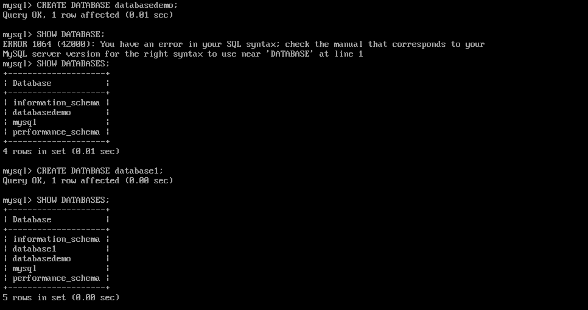
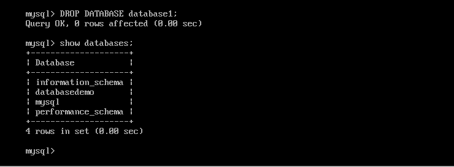
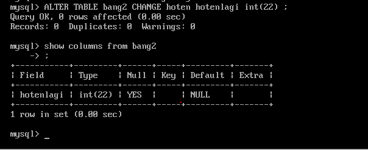
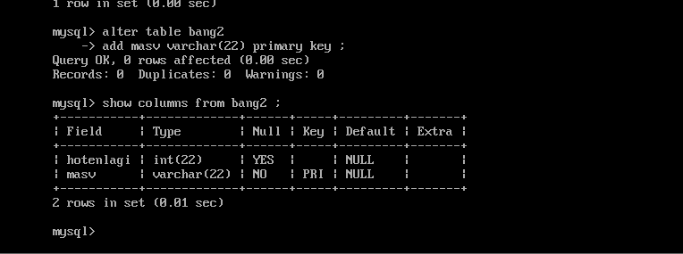
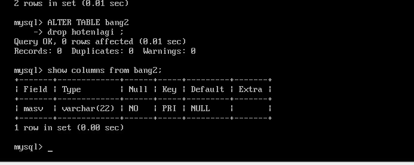
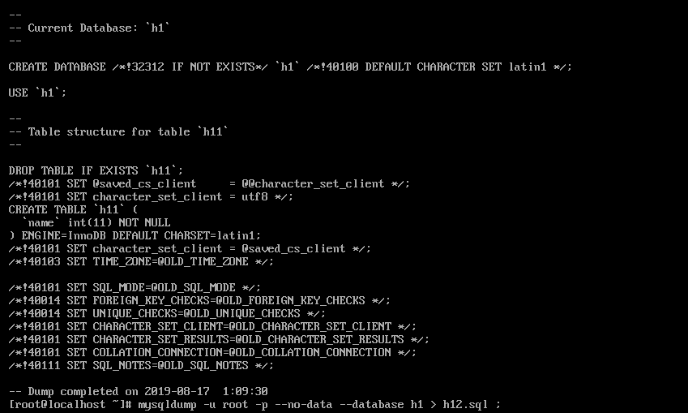
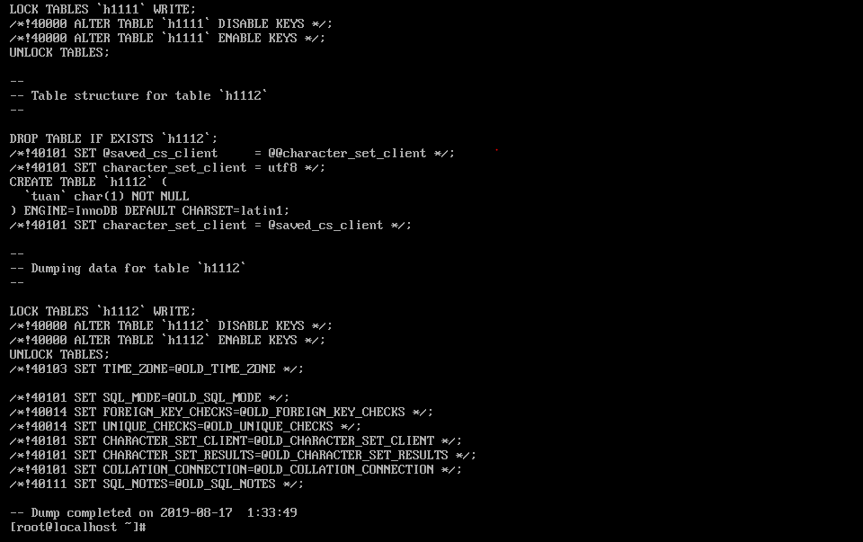

### Các thao tác với MySQL 
### NOTE
- import and export file .sql
```
mysql -u DatabaseUser -p DatabaseName < BackupDatabase.sql

mysqldump -u DatabaseUser -p DatabaseName > BackupDatabase.sql

Note : Import Database
mysql -u root -p
SET GLOBAL log_bin_trust_function_creators = 1;

```
### Xuất dữ liệu ra file CSV
- Thêm dòng lệnh ` secure-file-priv = "" ` vào file `/etc/my.cnf`

- Cấp quyền cho mysql trong thư mục (ở đây là tmp ) 
` chmod -R 1777 /tmp `
- Trao quyền cho mysql 
` chown mysql:mysql /tmp `


- Gửi các câu truy vấn ra dạng file csv
```
select * from SV 
into outfile '/tmp/tesst1.csv';
```
- Trong đó SV là tên của table , * là lấy tất cả các trường  , /tmp/tesst1.csv là đường dẫn 


> Trên CentOS, toàn bộ file raw database được lưu trong thư mục `var/lib/mysql ` 

#### 1. Thao tác trên Database

1. Tạo Database 
` CREATE DATABASE databae-name; `

2. Hiển thị toàn bộ Database
` SHOW DATABASES; `



3. Sử dụng một Database 
` USE name-database; `

4. Xóa Database
` DROP DATABASE name-database; `




#### 2. Thao tác trên Table 
##### Xem cấu trúc table ` DESC table_name ; `
1. Tạo Table

```
CREATE TABLE name-table(
name-colum(các trường)  kiểu-dữ-liệu rằng buộc ,
name-colum1(các trường)  kiểu-dữ-liệu rằng buộc ,
PRIMERY KEY (name-colum) ,
);
```
- Các kiểu dữ liệu chính 
	- INT : số nguyên
	- FLOAT(a,b) : float với a chữ số phần trước dấu phẩy và b chữ số hiển thị phần sau dấu phẩy
	- DATE : lưu ở định dạng year-month-day (2019-8-17)
	- DATETIME : lưu ở dạng year-month-day hours-minutes-seconds (2019-8-17 9:53:13)
	- CHAR(1-255) : kiểu kí tự , chuỗi nhập vào vẽ được thêm khoảng trắng sao cho bằng độ dài khai báo chuỗi.
	- VARCHAR(1-255) : kiểu kí tự, khác char ở chỗ có thể tùy biến linh hoạt độ dài chuỗi bằng dộ dài chuỗi nhập vào
	- 

- Các rằng buôc 
	- NOT NULL : Dữ liệu của cột(trường) không nhận giá trị NULL
	- DEFAULT  : Gán giá trị mặc định khi trường dữ liệu nhập vào không được nhập hoặc không xác định
	- UNIQUE : Dữ liệu trong cột (trường) là duy nhât 
	- PRIMARY KEY : Khóa chính Duy nhất- không null , khi khai báo khóa chính thường kết hợp vs NOT NULL
	- FOREIGN KEY : Khóa ngoại , Dùng để tham chiếu tới bảng khác thông qua cột giá trị được liên kết . 
		Cột( trường) trong bảng được tham chiếu phải có các giá trị là duy nhất trong bẳng đó (khóa chính của bảng được tham chiếu).
	- CHECK : Đảm bảo giá trị trong các trường phải đảm bảo yêu cầu nào đó 

```
vd:

CREATE TABLE SV(
masv varchar(20),
tensv varchar(20)
);

CREATE TABLE LOP(
tenlop varchar(20) NOT NULL PRIMARY KEY,
ngaythanhlap data DEFAULT GETDATE(),
masv int ,
FOREIGN KEY(masv) REFERENCES SV(masv),
sodienthoai int UNIQUE,
nawmhoc int CHECK(nawmhoc > 2)
);

```

2. Đặt tên cho CONSTRAINT ( theo ví dụ table LOP) 

- PRIMARY KEY ( khóa chính)
` CONSTRAINT name PRIMARY KEY (trường tenlop) `

- CONTRAINT FOREIGN KEY
` CONTRAINT name FOREIGN KEY (tên trường tham chiếu - masv) REFERENCES name-table-thamchieu(ten trường tham chiếu-masv)`

- UNIQUE
`CONSTRAINT name UNIQUE (tên trường) `

3. ADD thêm CONSTRAINT 

```
  ALTER TABLE tentable_cần_add
  ADD CONSTRAINT tên-constranint CHECK ( Trường kèm điều kiện ) ;
```
4. Xóa bỏ constraint 

```
 ALTER TABLE tentable-chuarangbuoc
 DROP CONSTRAINT tên-rang buoc ;
```

5. Xem tất cả các table trong database
` SHOW TABLES ; `

6. Dổi tên table 
` RENAME TABLE tên_cũ TO tên mới ;`

7. Xóa TABLE
` DROP TABLE tên-table; `


#### 3. Thao tác với cột và hàng

1. Xem các trường trong table
` SHOW COLUMNS FROM tên_table ;`


2. Đổi tên cho trường 
```
 ALTER TABLE tên-table
 CHANGE tentruongcu tentruong moi khai_bao rangbuoc;
```




3. Thêm trường cho table
```
ALTER TABLE tên-table
ADD tên-trương khai_báo rằng_buộc ;
```

 


4. Xóa trường trong table 
```
ALTER TABLE tentable
DROP tên_truong ;
```




#### 4. Sao lưu và phục hồi database
> Các lệnh sẽ được viết trên hệ thống chung ( không phải ở trong mục mysql )


1. Cấu trúc câu lệnh sao lưu toàn bộ dữ liệu trong Database
` mysqldump -u [user-name] -p [database-name] > [filename].sql `
- user-name : người có quền sao lưu dữ liệu 
- database : tên cơ sở dữ liệu cần sao lưu 
- filename : tên cần lưu 

- Với nhiều database chuyển [database-name] thành --all-databases 


 

2. Cấu trúc câu lệnh sao lưu CẤU TRÚC database 
` mysqldump -u root -p --no-data --databases  database-name > tên-sao-luu.sql `

- Với nhiều database thì database-name thành database-name1 database-name2 ....


 


3. Khôi phục database 
` mysqldump -u root -p database-name < tên_file lưu trước đó .sql ; `

- database-name phải tồn tại trước trong Database 


4. Sao lưu một số bảng trong database 

` mysqldump --add-drop-table -u root -p database-name table1 table2 > ten.sql ; `

 





