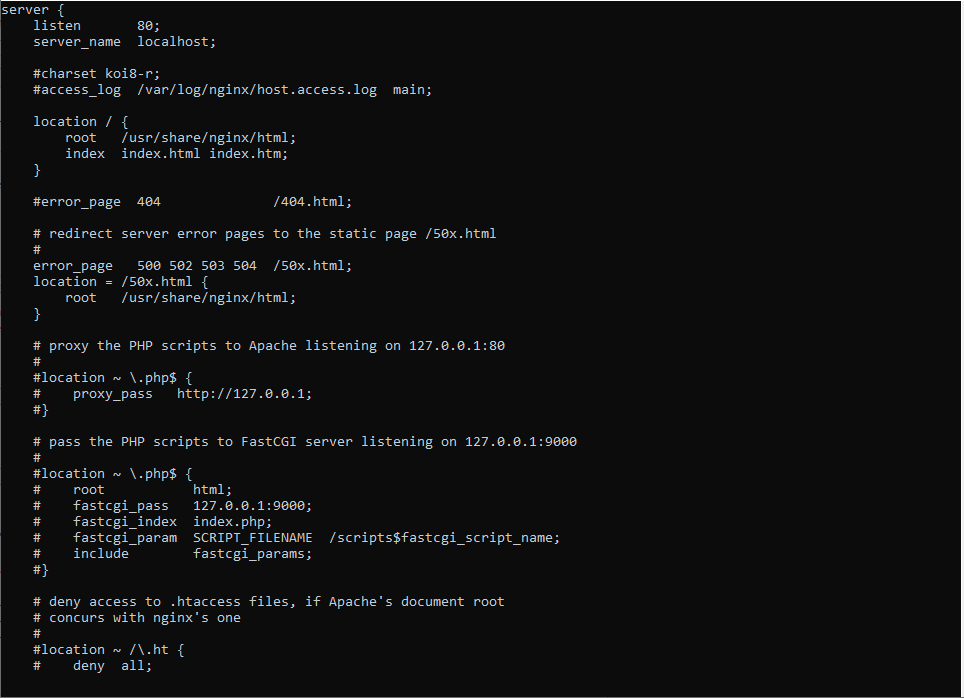
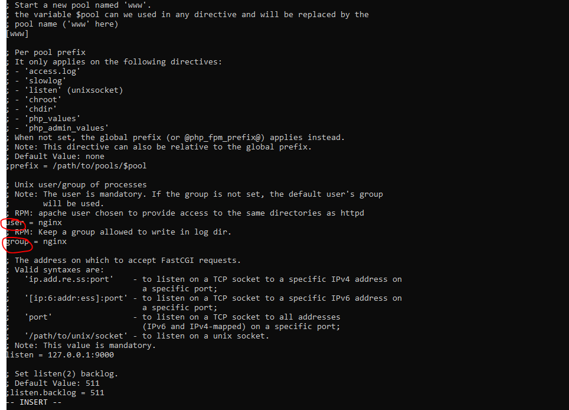
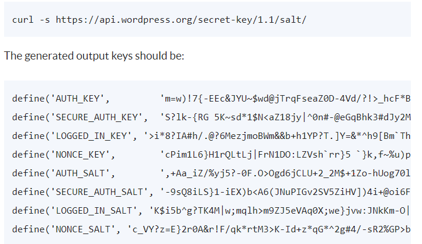

### 1. Thêm các repo cần thiết
#### 1.1 Tải thêm EPEL repository
` yum install epel-release `

#### 1.2 Tải thêm REMI repository
` rpm -Uvh http://rpms.famillecollet.com/enterprise/remi-release-7.rpm `

#### 1.3 Tải thêm NGINX repository 
` rpm -Uvh http://nginx.org/packages/centos/7/noarch/RPMS/nginx-release-centos-7-0.el7.ngx.noarch.rpm `

### 2. Cài đặt NGINX , PHP
- Bản php 7.0 : ` yum --enablerepo=remi,remi-php70 install -y nginx php-fpm php-common `
- Bản php 7.2 : ` yum --enablerepo=remi,remi-php72 install -y nginx php-fpm php-common `

##### Một số module PHP thông dụng:

- OPcache (php-opcache) – The Zend OPcache provides faster PHP execution through opcode caching and optimization.
- APCu (php-pecl-apc) – APCu userland caching
- CLI (php-cli) – Command-line interface for PHP
- PEAR (php-pear) – PHP Extension and Application Repository framework
- PDO (php-pdo) – A database access abstraction module for PHP applications
- MySQL (php-mysqlnd) – A module for PHP applications that use MySQL databases
- PostgreSQL (php-pgsql) – A PostgreSQL database module for PHP
- MongoDB (php-pecl-mongo) – PHP MongoDB database driver
- SQLite (php-pecl-sqlite) – Extension for the SQLite Embeddable SQL Database Engine
- Memcache (php-pecl-memcache) – Extension to work with the Memcached caching daemon
- Memcached (php-pecl-memcached) – Extension to work with the Memcached caching daemon
- GD (php-gd) – A module for PHP applications for using the gd graphics library
- XML (php-xml) – A module for PHP applications which use XML
- MBString (php-mbstring) – A module for PHP applications which need multi-byte string handling
- MCrypt (php-mcrypt) – Standard PHP module provides mcrypt library support

##### Để cài đặt cần sử dụng thêm lệnh ` yum --enablerepo=remi,remi-php72 install ten_module` 

##### Cài một số modul php phổ biến : ` yum --enablerepo=remi,remi-php72 install php-opcache php-pecl-apcu php-cli php-pear php-pdo php-mysqlnd php-pgsql php-pecl-mongodb php-pecl-redis php-pecl-memcache php-pecl-memcached php-gd php-mbstring php-mcrypt php-xml php-fpm ` 

#### 2.1 Một số Systemctl với NGINX với PHP-FPM
- NGINX 
```
systemctl stop httpd.service
systemctl start nginx.service
systemctl restart nginx.service
systemctl enable nginx.service
```
- PHP-FPM
```
systemctl start php-fpm.service
systemctl restart php-fpm.service
systemctl enable php-fpm.service
```

### 3. Cấu hình để NGINX hoạt động với PHP 7.
#### 3.1 Chỉnh worker_processes bằng với số processor VPS 
- Xem thông tin VPS trong ` cat/proc/cpuinfo ` . Xem ` processor `	
- Chỉnh thông số worker_processes trong ` /etc/nginx/nginx.conf `
- Set worker_processes = processes

### 3.2 Cấu hình NGINX virtual host
- Truy cập vào ` /etc/nginx/conf.d/default.conf ` và setup các thông số:



- server_name : tên trang web hoặc IP của của trang web
- Thêm index.php trong location /index

### 3.3 Cấu hình PHP-FPM

 

- Chỉnh user và group trong file ` /etc/php-fpm.d/www.conf ` .
- Chuyển user và group từ apache sang nginx.
- listen.owner và listen.group từ nobody sang nginx
- listen = 127.0.0.1:9000  ` chưa chuyển được cổng nghe: listen = /var/run/php-fpm/php-fpm.sock `

### 3.4 Test cấu hình NGINX và PHP-FPM
- Tao và sửa file ` /var/www/html/example.com/info.php `
- Thêm nội dung vào file trên:
```
<?php
phpinfo();
?>
```
- Thay đổi thông số trong ` /etc/nginx/conf.d/default.conf`
- Cấp quyền cho NGINX trong file `chown -R nginx:nginx /var/www/html/example.com/ `
- Tùy trỉnh nội dụng trong file ` etc/nginx/conf.d/default.conf` phía dưới :


```
try_files $uri $uri/ /index.php?q=$uri&amp$args;
$document_root
```

### 4. Cài Mysql , tạo tài database , user , phân quyền.
#### NOTE:
- Tạo file ` dbcheck.php ` trong ` /var/www/html/example.com/ ` để kiểm tra lỗi.

```
<?php
$con = mysqli_connect("localhost","userwp2","Hse@12345","dbwp1");
 
// Check connection
if (mysqli_connect_errno())
  {
  echo "Failed to connect to MySQL: " . mysqli_connect_error();
  }
?>

```
- Trong khi tạo tài khoản kết nối db cần thay đổi phương thức xác thực bằng lệnh 
` ALTER USER 'sername'@'localhost' IDENTIFIED WITH mysql_native_password BY 'Password'; `

 - Để cho phép connect database từ xa thì sửa địa chỉ ip trong file `/etc/my.cnf`
 
 
 


### 5. Thay đổi các thông số trong NGINX viết trong file ` vi /etc/nginx/conf.d/default.conf`


- Trong đó:
	- Server_name : Tên server
	- accesss_log : Nhật kí đăng nhập thành công
	- error_log : Nhật kí đăng nhập thất bại
	- root : đường dẫn DOCUMENT
	- trong phần php là cái gì thì chưa biết
### 6. Xác minh các tập vừa cấu hình;
` nginx -t`
- nếu thông tin chính xác thì sẽ nhận được 
```
nginx: the configuration file /etc/nginx/nginx.conf syntax is ok
nginx: configuration file /etc/nginx/nginx.conf test is successful
```

### 8. Cài đặt WordPress
#### 8.1 Tải wordpress vào thư mục tmp tạm thời

` cd /tmp ` 

- Download wordpress 
` wget https://wordpress.org/latest.tar.gz `

- Giải nén wordpress
` tar xzvf latest.tar.gz `

- Chuyển file sang website cài đặt (example.com)
` mv /tmp/wordpress/* /var/www/html/example.com/ `


- Chuyển file từ` wp-config-example.php `  sang ` wp-config.php `
` mv wp-config-sample.php  wp-config.php `

- Trao quyền cho Nginx
` chown -R nginx:nginx /var/www/html/example.com `





- ` curl -s https://api.wordpress.org/secret-key/1.1/salt `

- Lấy key từ API wordpress vào chèn vào ` wp-confing.php ` 


- Sửa thông tin cấu hình DB trong mục ` /var/www/html/example.com/wp-config.php `


### 9 Test
- Truy cập vào http://ip(host_name)/wp-admin

### 10 Check lỗi FTP

- Mở file `wp-config.php ` trong thư mục ` /var/www/html/example.com `
- Thêm các lệnh sau vào `wp-config.php`
```
define( 'FTP_USER', 'Quang' );
define( 'FTP_PASS', 'Hse@123a' );
define( 'FTP_HOST', '10.2.9.52' );
define('FS_METHOD','direct');

```
- Cấp quyền cho thư mục ` chmod 777 /yourwebsitename/public/wp-content/plugins/`


