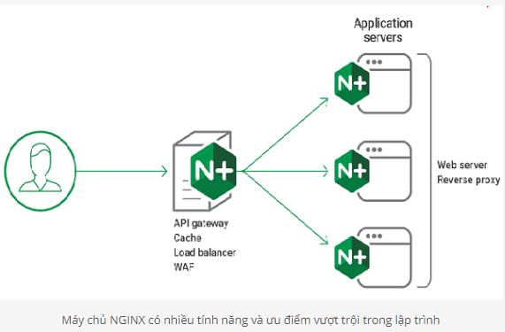

### A. Tổng quan về NGINX

> NGINX là một phần mềm web server mã nguồn mở, sử dụng kiến trúc hướng sự kiện (event-driven) không đồng bộ (asynchronous). Mục tiêu ban đầu
để phục vụ HTTP cache nhưng sau được áp dụng vào reverse proxy, HTTP load balancer và các giao thức truyền mail như IMAP4, POP3, và SMTP.NGINX 
chính thức ra đời vào tháng 10/2014. Đây là phần mềm giúp server có tốc độ và khả năng mở rộng lớn nhất, đồng thời, xử lý và thao tác trên 
hàng nghìn kết nối cùng lúc. Do đó, rất nhiều “ông lớn” công nghệ hiện nay đều lựa chọn NGINX như Google, Adobe, Netflix, WordPress…

### 1. Hoạt động của NGINX

- Về cơ bản, NGINX cũng hoạt động tương tự như các web server khác. Khi bạn mở một trang web, trình duyệt của bạn sẽ liên hệ với server chứa
website đó. Server sẽ tìm kiếm đúng file yêu cầu của website và gửi về cho bạn. Đây là một trình tự xử lý dữ liệu single – thread, nghĩa là 
các bước được thực hiện theo một trình tự duy nhất. Mỗi yêu cầu sẽ được tạo một thread riêng.

- Tuy nhiên, NGINX hoạt động theo kiến trúc bất đồng bộ (asynchronous) hướng sự kiện (event driven). Nó cho phép các threads tương đồng 
được quản lý trong một tiến process. Mỗi process hoạt động sẽ bao gồm các thực thể nhỏ hơn, gọi là worker connections dùng để xử lý tất cả 
threads.

- Worker connections sẽ gửi các yêu cầu cho worker process, worker process sẽ gửi nó tới master process, và master process sẽ trả lời các yêu
cầu đó. Đó là lý do vì sao một worker connection có thể xử lý đến 1024 yêu cầu tương tự nhau. Nhờ vậy, NGINX có thể xử lý hàng ngàn yêu cầu 
khác nhau cùng một lúc.

### 2. Tính năng của NGINX

##### Các ưu điểm nổi bật của NGINX

- Có thể xử lý hơn 10.000 kết nối cùng lúc với bộ nhớ thấp
- Phục vụ tập tin tĩnh (static files) và lập chỉ mục tập tin
- Tăng tốc proxy ngược bằng bộ nhớ đệm (cache), cân bằng tải đơn giản và khả năng chịu lỗi
- Hỗ trợ tăng tốc với bộ nhớ đệm của FastCGI, uWSGI, SCGI, và các máy chủ memcached
- Kiến trúc modular , tăng tốc độ nạp trang bằng nén gzip tự động
- Hỗ trợ mã hoá SSL và TLS
- Cấu hình linh hoạt; lưu lại nhật ký truy vấn
- Chuyển hướng lỗi 3XX-5XX
- Rewrite URL (URL rewriting) dùng regular expressions
- Hạn chế tỷ lệ đáp ứng truy vấn
- Giới hạn số kết nối đồng thời hoặc truy vấn từ 1 địa chỉ
- Khả năng nhúng mã PERL
- Hỗ trợ và tương thích với IPv6
- Hỗ trợ WebSockets
- Hỗ trợ truyền tải file FLV và MP4.

### B. Sự khá biệt giữa NGINX và APACHE

- So với Apache server , Nginx server có nhiều ưu điểm nổi bật hơn . Sự khác biệt cơ bản giữa Nginx-Apache là cách xử lý kết nối:

- Apache sử dụng cơ chế chia luồng (forked threaded) hoặc keep-alive , giữ một kết nối mở cho mỗi người dùng. NGINX sử dụng vòng lặp sự
kiện không bị chặn (Non-blocking event loop) giúp các kết nối vùng (pools connection) hoạt động không đồng bộ thông qua các tiến trình công
việc. Nhờ đó NGINX hỗ trợ CPU và RAM không bị ảnh hưởng bởi nhữn thời điểm có lượng truy cập cao.

- Khi Apache server có thể xử lý cả nọi dung tĩnh bằng cách sử dụng các phương pháp dựa trên file thông thường  và nội dung động bằng cách
nhũng một bộ xử lý của ngôn ngữ thì Nginx chỉ xử lý được nội dung tĩnh . Do đó , khi cấ hình server này và bộ vi xử lý dựa trên những giao 
thức mà nó có thể kết nối được.

- So với Apache , Nginx mang lại nhiều uw điểm hơn. Nginx sở hữu hầu hết các tính năng của Apache , bên cạnh đó tốc độ xử lý cực cao và hiệu 
suất đồng bộ máy chủ của NGinx cũng cao hơn rất nhiều so với Apache. Đặc biệt server sử dụng Nginx sử dụng rất ít CPU và Ram mặc dù khối lượng
truy vấn cực cao.