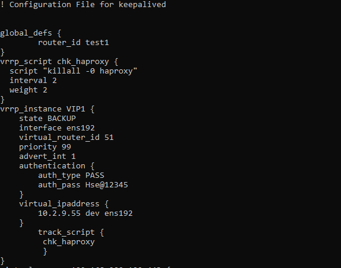
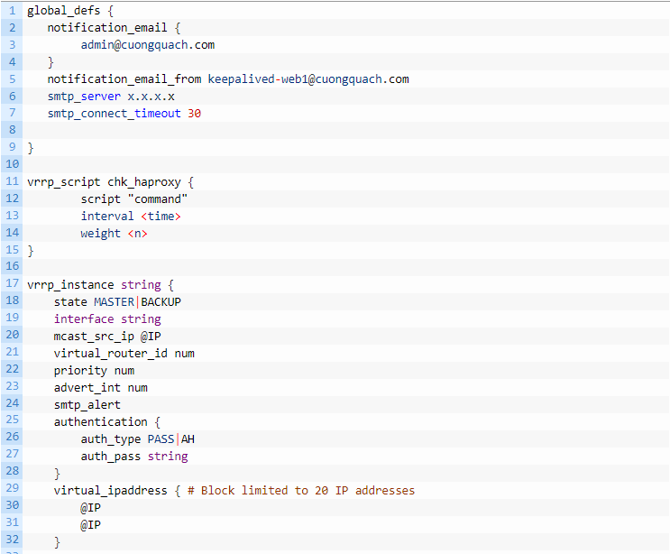

### 1. Mô hình LAB
- Sử dụng 1 server với ip lần lượt là
	- 10.2.9.50 (MASTER)
	- 10.2.9.51 (BACKUP)
- Sử dụng VIP là 10.2.9.55/24

### 2. Cài đặt 
- Thực hiện cài đặt Keepalived trên cả 2 node
```
yum update
yum install gcc kernel-headers kernel-devel
yum install keepalived
```

- Để máy chủ định nghĩa IP  chứ ko phải là card mạng định nghĩ thì tao sửa  file thêm cấu hình  ` /etc/sysctl.conf` 

```
net.ipv4.ip_nonlocal_bind = 1
net.ipv4.ip_forward = 1
```
- Khởi động lại card mạng 
`systemctl restart network`

### 2.1 Cài đặt trên Master
##### Truy cập vào file ` /etc/keepalived/keepalived.conf ` thực hiện cấu hình.




#### Trong đó:
- `global_def` : Cấu hình thông tin toàn cục(global) cho keepalived như gửi mail thông báo tới đâu hay tên của cluster đang cấu hình
- `vrrp_script` : Chứa script , lệnh thực thi hoặc đường dẫn tới script kiểm tra dịch vụ ( vd: nếu một dịch down thì keepalived sẽ chuyển VIP
sang 1 server khác)
- ` vrrp_instance` : thông tin chi tiết về 1 server vật lý nằm cùng cụm dùng chung VRRP. Gồm các thông tin như interface , độ ưu tiên , VIP tương
ứng với interface, cách thức chứng thực , script kiểm tra dịch vụ...



- Một số thông số trong VRRP-Instance.
	- state (MASTER | BACKUP) : Master nhận và xử lý các gói tin từ host, Backup dự phòng trở thành Master khi con Master bị sập.
	- interface : cổng mạng dùng cho hoạt động (IP Failover -VRRP).
	- virtual_router_id : định danh của các router(ở đây là máy chủ vật lý) thuôc cùng một VRRP. Một server có thể tham gia vào nhiều VRRP.
	- priority : Thứ tự ưu tiên làm Master . Nếu priority bằng nhau thì máy nào có IP cao hơn sẽ làm Master.
	- advert_int : Thời gian giữa các lần gửi gói tin VRRP advertisement(đơn vị giây)
	- virtual_ipaddress : địa chỉ VIP / Netmask của cụm VRRP và Interface của máy dùng VIP.
	- authentication : chỉ định hình thức xác thực trong VRRP.`auth_type` sử dụng mật khẩu plantext  hay mã hóa AH. `auth_pass` chuỗi mật
	khẩu thường là 8 kí tự 
	- track_script : Đoạn chạy script.


https://www.codeproject.com/Articles/1272428/MySQL-Auto-Failover-using-Keepalived-on-CentOS
