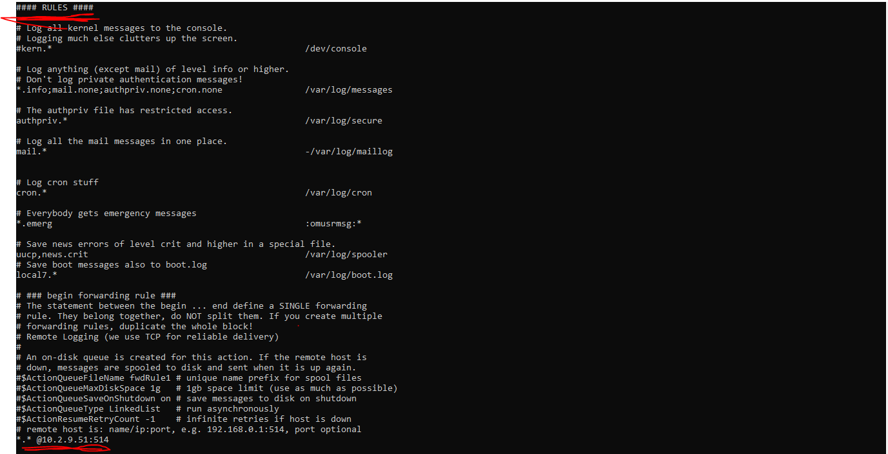
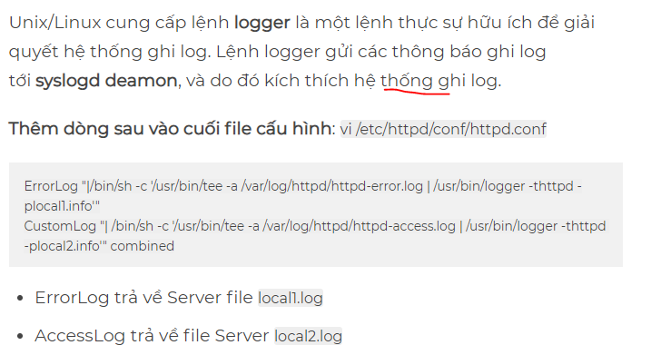

### LAB triển khai log tập trung.

### A. Mô hình triển khai
- 1 Rsyslog Server : CentOS_7 IP: 10.2.9.50
- 1 Rsyslog Client : CentOS_7 IP: 10.2.9.51

### B. Triển khai
### 1. Trên Rsyslog Server
#### 1.1 Chỉnh file cấu hình của Rsyslog server : ` /etc/rsyslog.conf `

- Bỏ comment vào phần MODULES chọn giao thức TCP hoặc UDP để truyền syslog
- Sử dụng port 514 để truyền gửi log 
	


##### Để Log lưu thành từng mục riêng đối với log từng máy ta có thể thêm laahj sau vào cuối file cấu hình :
- Lưu thư mục dưới tên IP của  rsyslog client
```
$template RemoteServer, "/var/log/%fromhost-ip%/%SYSLOGFACILITY-TEXT%.log"
*.* ?RemoteServer
```

- Lưu thư mục dưới tên Hostname của rsyslog client
```
$template RemoteServer, "/var/log/%HOSTNAME%/%SYSLOGFACILITY-TEXT%.log"
*.* ?RemoteServer
```

- Ngoài ra bạn có thể sử dụng cấu hình sau để lưu các file log với tên các chương trình:
```
$template TmplAuth,"/var/log/%HOSTNAME%/%PROGRAMNAME%.log" #hostname
*.*     ?TmplAuth
$template TmplAuth,"/var/log/%fromhost-ip%/%PROGRAMNAME%.log" #ip-server
*.*     ?TmplAuth
```

#### 1.2 Mở port 514

```
firewall-cmd --permanent --add-port=514/udp
firewall-cmd --permanent --add-port=514/tcp
firewall-cmd --reload
```

#### 1.3 Khởi động lại Rsyslog-server của bạn và đảm bảo rằng nó hiện đang lắng nghe trên cổng 514 cho UDP hoặc TCP

```
[root@vqmanh ~]# systemctl restart rsyslog
[root@vqmanh ~]# netstat -una | grep 514
udp        0      0 0.0.0.0:514             0.0.0.0:*
udp6       0      0 :::514                  :::*
```

- Nếu sử dụng TCP để truyền gửi syslog thì dùng lệnh
```
netstat -tna | grep 514
```


### 2. Triển khai trên Rsyslog trên client


- Với UPD là 1 @ còn với TCP là  @@

#### 2.1 Với Client dùng OS: CentOS_7




- Khai báo IP của Rsyslog server trong phần RULES trong file ` /etc/rsyslog.conf `

- Sau đó khởi động lại Rsyslog ` systemctl restart rsyslog` 

#### 2.2 Với Client dùng OS: Ubuntu

- Khai báo IP của Rsyslog server trong file cấu hình ` /etc/rsyslog.d/50-default.conf  `

- Sau đó khởi động lại Rsyslog 

### 3. Đứng trên Rsyslog của Server bắt gói tin tcpdump
- Dùng lềnh ` tcpdump -nni ens192 port 514 ` để theo dõi 
	- ens192 là card mạng bắt gói tin
	- 514 là port nhận dữ liệu gửi về

### 4. Sử dụng lệnh LOGGER (tham khảo thêm)




### C. Gửi log NGINX về cho Rsyslog Server
#### Khi cài thêm dịch vụ , các service sẽ tự động tạo ra các thư mục chứa log ở ` /var/log`. Để thực hiện đẩy log về cho server
##### 1. Tạo file cấu hình ` name_servicelog.conf` 
- Tạo file 'nginx.conf` trong thư mục ` /etc/rsyslog.d `
- Sửa cấu hình file `nginx.conf`
```
$ModLoad imfile #Dòng này chỉ thêm một lần

# nginx error file: 
$InputFileName /var/log/nginx/error.log #Đường dẫn file log muốn đẩy
$InputFileTag errorlog #Tên file 
$InputFileSeverity info #Các log từ mức info trở lên được ghi lại
$InputFileFacility local3 #Facility log
$InputRunFileMonitor

# nginx access file:
$InputFileName /var/log/nginx/access.log
$InputFileTag accesslog
$InputFileSeverity debug
$InputFileFacility local4
$InputRunFileMonitor

$InputFilePollInterval 10 #Cứ sau 10 giây lại gửi tin nhắn

```

- Cập nhật lại file cấu hình rsyslog và kiểm tra các mess

### D. Gửi log MYSQL về cho Rsyslog Server
#### 1. Xem log của mysql được lưu trong mục nào vào `  /etc/my.cnf`
#### 2. Tạo file cấu hình `name_servicelog.conf`
- Tạo file ` mysqld.conf ` trong thư mục ` /etc/rsyslog.d `
- Sửa file mysqld.conf  với nội dung 

```
$ModLoad imfile #Dòng này chỉ thêm một lần

# mysql error file: 
$InputFileName /var/log/mysqld.log #Đường dẫn file log muốn đẩy
$InputFileTag mysqldlog #Tên file 
$InputFileSeverity info #Các log từ mức info trở lên được ghi lại
$InputFileFacility local5 #Facility log
$InputRunFileMonitor
$InputFilePollInterval 10 #Cứ sau 10 giây lại gửi tin nhắn

```


