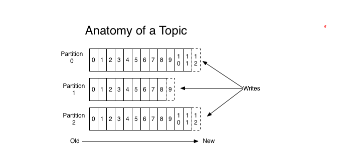

### A. Hướng dẫn cài đặt ELK sử dụng Kafka làm cache

> Khi log được đẩy về quá nhiều , khiến việc lưu trữ dữ liệu trở nên khó khăn và rất có thể gây ra tình trạng treo hệ thống do không kịp xử lý được dữ liệu gửi về. Khi đó ta sẽ cần phải có một (cache) bộ nhớ đệm để lưu trữ tạm thời dữ
liệu , khi master nhàn dỗi hơn thì sẽ thực hiện đọc lại dữ liệu lưu trong cache.

### 1. Tổng quan về Kafka

- Kafla là hệ thống message pub/sub phân tán có khả năng sacle
- Messega của Kafka được lưu trên đĩa cứng , đồng thời được replicate trong cluster giúp phòng tránh việc bị mất dữ liệu 

- Mộ số khái niệm cơ bản trong Kafka
	- Kafla lưu , phân loại message theo topic
	- Kafla sử dụng prodcer để publich message vào các topic ở trên.
	- Kafla sử dụng consumers để subscribe vào topic  , sau đó xử lý các message lấy được theo một giao thức nào đó.
	- Kafla thường được chạy dưới dạng cluster , khi đó mỗi server trong đó được gọi à broker.


### 2. Các thành phần cấu tạo trong Kafka
### 2.1 Topic

- Topic có thể hiểu là một ngôn ngữ chung giữa producer (người nói) và consumer (người nghe) . Với mỗi topic , kafla sẽ duy trì thông qua partitioned log như dưới: 



- Mỗi partition là một chuỗi log , có thứ tự và không thể thay đổi
- Mỗi massaage trong partition sẽ có id tăng dần , gọi là offset
- Kafka luster sẽ lưu lại mọi message đượcgọi là published cho dù các message đó đã được/chưa sử dụng (consume).
- Consumer sẽ điều khiển những gì mà ta muốn đọc thông qua offset của message. Consumer có thể reset lại vị trí của offset để re-process lại mội vài message nào đó.


### 2.2 Producer 

- Producer có chức năng gửi các message vào topic , lựa chọn partition để lưu message trong topic .


### 2.3 Consumer
### 2.4 Use case

### B.Cài đặt 
 
### 1.Mô hình cài đặt

- Sử dụng thêm một node trung gian nữa các node clinet và node ELK server làm Cache cho quá trình lưu log gửi về. 
- IP ELK : 10.2.9.50
- IP node client : 10.2.9.51   10.2.9.52
- IP node Kafla : 10.2.9.53

### 2. Cài đặt và config trên node Kafka.

- Download kafka - giải nén - cài đặt Java
```
wget http://mirror.downloadvn.com/apache/kafka/2.4.0/kafka_2.13-2.4.0.tgz

tar -zxvf kafka_2.13-2.4.0.tgz

yum install java-1.8.0-openjdk-headless
```

- Cấu hình enviroment 
```
vi /etc/enviroment

export JAVA_HOME=/usr/lib/jvm/jre-1.8.0-openjdk
export JRE_HOME=/usr/lib/jvm/jre
```

- Truy cập và run file

```
yum install -y screen

cd /root/kafka_2.13-2.4.0
screen -d -m bin/zookeeper-server-start.sh config/zookeeper.properties
screen -d -m bin/kafka-server-start.sh config/server.properties
```

- Tạo Topic mới để nhận log
` bin/kafka-topics.sh --create --zookeeper localhost:2181 --replication-factor 1 --partitions 1 --topic name_topic? `

- List các topic hiện có

` bin/kafka-topics.sh --list --zookeeper localhost:2181 `


### 3. Cấu hình và config trên node ELK (Server)

- Tạo file cấu hinh logstash và thêm nội dung : 
```

vi /etc/logstash/conf.d/02-logstash.conf

input {
    kafka {
            bootstrap_servers => '10.2.9.53:9092'
            topics => ["test-cluster-kafla"]
            codec => json {}
          }
}

output {
    elasticsearch {
      hosts => ["10.2.9.50:9200"]
      sniffing => true
      index => "%{[@metadata][beat]}-%{+YYYY.MM.dd}"
    }
}

sysstemctl restart logstash

```

### 4. Cấu hình filebeat trên node client đẩy log về Kafla

```
vi /etc/filebeat/filebeat.yml

filebeat:
  prospectors:
    - paths:
        - /var/log/*.log
      encoding: utf-8
      input_type: log
      fields:
        level: debug
      document_type: type
  registry_file: /var/lib/filebeat/registry
output:
  kafka:
    hosts: ["ip-kafka:9092"]
    topic: log-syslog
logging:
  to_syslog: false
  to_files: true
  files:
    path: /var/log/filebeat
    name: filebeat
    rotateeverybytes: 1048576000 # = 1GB
    keepfiles: 7
  selectors: ["*"]
  level: info


systemctl start filebeat

```

https://www.digitalocean.com/community/tutorials/how-to-install-apache-kafka-on-centos-7


