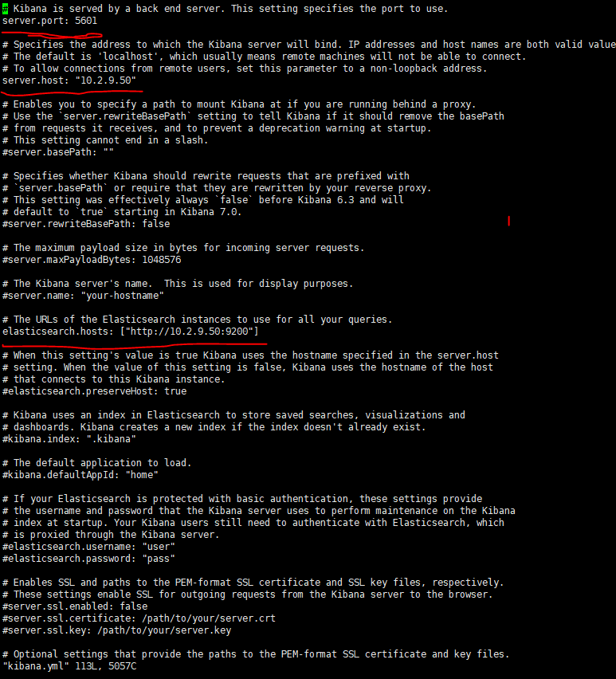

###  A. Tổng quan về ELK

### 1. ELK là gì ?

> ELK là một công cụ ghi lại log đơn giản và mạnh mẽ được sử dụng rất phổ biến trong việc giám sát hoạt động của hệ thống. ELK là viết tắt 3 chữ cái đầu của  Elasticsearch  , Logstash và Kibana .

- Elasticsearch : Cơ sở dữ liệu để lưu trữ , tìm kiếm và query log.
- Logstash : Collect log từ nhiều nguồn , sau đó xử lý log và ghi dữ liệu vào Elasticsearch
- Kibana : Giao diện để quản lý , thống kê log . Đọc thông tin từ Elasticsearch

#### 1.1 Ưu điểm của ELK : 
- ELK có thể đọc log từ nhiều nguồn khác nhau : Logstash sẽ làm nhiệm vụ thu thập các log từ các hệ thống server hay file log của service như MySql , Nginx ....
- ELK dễ tích hợp với nhiều nền tảng service khác nhau 
- ELK là ứng dụng hoàn toàn miễn phí . ELK stack kiếm tiền bằng các dịch vụ Cloud hoặc các sản phẩm premium phụ thêm 
- ELK có khả năng Scale tốt . 
- ELK có khả năng Search và Filter mạnh mẽ . Elasticsearch lưu chữ các collect log được đưới dạng noSQL có thể query dễ dàng và nhanh chóng.


#### 1.2 Cơ chế hoạt động của ELK stack


- Đầu tiên Logstash sẽ colletc các nguồn log từ nhiều node server khác nhau ....
- Logstash đọc các log và thêm các thông tin như ip , time ,parse của dữ liệu log nhận được.
- Tiếp theo log sẽ được đẩy tới cho Elasticsearch để lưu trữ xuống DB.
- Khi muốn xem log thì ta có thể truy cập vào URL của Kibana . Kibana sẽ đọc log của Elasticsearch và hiển thị dưới dạng giao diện cho người dùng query , xử lý.


### 2. Các thành phần của ELK stack
#### 2.1 Logstash 

- Logstash có chức năng phân tích cú pháp của dòng dữ liệu nhận về . Phân tích dữ liệu nhận về và chuyển sang một dạng dữ liệu dễ đọc qua các nhãn được gán thêm vào và khi đó dữ liệu có một dạng cấu trúc nhất định.
- Cấu hình Logstash luôn có 3 phần  : Input , Filter và Output
- Logstash được sử dụng chủ yếu với phần Filter . Filter hiện nay sử dụng Grok để phân tích dữ liệu.

#### 2.2 Elasticsearch 

- Elasticsearch là một RESTful distributed search engine. Hiểu nôm na là nó cung cấp khả năng tìm kiếm phân tán qua API. Lưu trữ dữ liệu theo dạng NoSQL database (cơ sở dữ liệu không có cấu trúc).

- Elasticsearch cho phép thực thi và kết hợp nhiều loại tìm kiếm : có cấu trúc , không cấu trúc .....tùy thuộc vào người dùng muốn tìm kiếm.
- Elasticsearch rất nhanh ,ngay lập tức ta có thể có kết quả tìm kiếm dữ liệu .
- Elasticsearch sử dụng chuẩn RESTful APIs và JSON .

#### 2.3 Kibana

- Kibana được phát triển riêng cho ứng dụng ELK để thực hiện chuyển đổi các truy cấn của người dùng thành các truy vấn mà ELasticsearch có thể hiển thị được. Kết quả sẽ hiển thị dưới dạng biểu đồ.


### B. Cài đặt ELK để th thập log

### 1 Mô hình Lab

- Sử dụng hai máy cài OS : CentOS 7 .
	- Một máy cài ELK server .
	- Một máy còn lại thực hiện chức năng đẩy log về ELK server.
- Địa chỉ IP 
	- ELK server : 10.2.9.50
	- Client đẩy log : 10.2.8.51

### 2 Cài đặt trên máy chủ ELK
#### 2.1 Cài đặt Logstash

- Thêm repo cho Logstack: 
```
vi /etc/yum.repos.d/logstash.repo

[logstash-6.x]
name=Elastic repository for 6.x packages
baseurl=https://artifacts.elastic.co/packages/6.x/yum
gpgcheck=1
gpgkey=https://artifacts.elastic.co/GPG-KEY-elasticsearch
enabled=1
autorefresh=1
type=rpm-md

```

- Cài đặt Logstash và khởi động dịch vụ

```
yum install logstash -y

systemctl daemon-reload
systemctl start logstash
systemctl enable logstash

```

 
#### 2.2 Cài đặt Elasticsearch 
- Cài java trên Cenos 7
```
yum install java-1.8.0-openjdk-headless

java -version
```

- import key elastic : 
` rpm --import http://packages.elastic.co/GPG-KEY-elasticsearch `

- Thêm repo elastic : 
```
vi /etc/yum.repos.d/elasticsearch.repo

[elasticsearch-6.x]
name=Elasticsearch repository for 6.x packages
baseurl=https://artifacts.elastic.co/packages/6.x/yum
gpgcheck=1
gpgkey=https://artifacts.elastic.co/GPG-KEY-elasticsearch
enabled=1
autorefresh=1
type=rpm-md
```

- Cài đặt Elasticsearch
` yum install elasticsearch -y `

- Mở file ` /etc/elasticsearch/elasticsearch.yml ` chỉnh sửa lại  ` network.host `


- Kiểm tra dịch vụ Elasticsearch 
` curl -X GET http://10.2.9.50:9200 `


#### 2.3 Cài đặt Kibana 

- Tạo repo cho Kibana :

```
vi /etc/yum.repos.d/kibana.repo

[kibana-6.x]
name=Kibana repository for 6.x packages
baseurl=https://artifacts.elastic.co/packages/6.x/yum
gpgcheck=1
gpgkey=https://artifacts.elastic.co/GPG-KEY-elasticsearch
enabled=1
autorefresh=1
type=rpm-md

```

- Cài đặt Kibana và khởi động dịch vụ 

```
yum install kibana -y

server.port: 5601
server.host: "10.2.9.50"
elasticsearch.hosts : ["http://10.2.9.50:9200"]

systemctl daemon-reload
systemctl start kibana
systemctl enable kibana

```

- Truy cập vào Kibana để kiểm tra : 
` http://10.2.9.50:5601 `





### 3. Cài đặt Filebeat trên Clinet để đẩy log về ELK 
- Thêm rep Elasticsearch : 

```
vi /etc/yum.repos.d/elastic.repo

[elasticsearch-6.x]
name=Elasticsearch repository for 6.x packages
baseurl=https://artifacts.elastic.co/packages/6.x/yum
gpgcheck=1
gpgkey=https://artifacts.elastic.co/GPG-KEY-elasticsearch
enabled=1
autorefresh=1
type=rpm-md

```
- Cài đặt filebeat

` yum install filebeat-6.2.4 -y `

- Coppy file cấu hình để backup

```
cp /etc/filebeat/filebeat.yml /etc/filebeat/filebeat.yml.orig
rm -rf /etc/filebeat/filebeat.yml
touch /etc/filebeat/filebeat.yml
```

- Thêm file `filebeat` vào dòng cấu hình sau 

```
vi /etc/filebeat/filebeat.yml

filebeat:
prospectors:
    - paths:
        - /var/log/*.log
    encoding: utf-8
    input_type: log
    fields:
        level: debug
    document_type: type
registry_file: /var/lib/filebeat/registry
output:
logstash:
    hosts: ["10.10.10.190:5044"]
    worker: 2
    bulk_max_size: 2048
logging:
to_syslog: false
to_files: true
files:
    path: /var/log/filebeat
    name: filebeat
    rotateeverybytes: 1048576000 # = 1GB
    keepfiles: 7
selectors: ["*"]
level: info

```
- Khởi động filebeat và dùng tcpdup để kiểm tra

```
systemctl start filebeat
systemctl enable filebeat

tcpdump -i 2 | grep 10.2.9.50 

```


