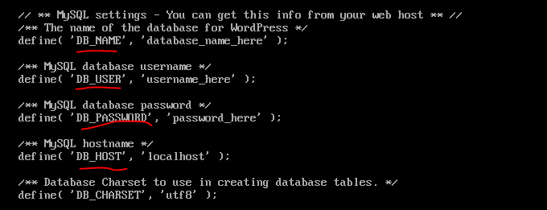

### A. Cài WordPress trên 2 máy
#### 1. Cài đặt trên MySql 
- Có hướng dẫn trong phần MySql trước đó rồi 
#### 2. Tạo Database cho WordPress 
- Đăng nhập vào MySql với quyền root 
` mysql -u root -p `

- Tạo Database cho WordPress 
` CREATE DATABASE tên-database ; `


- Tạo User cho WordPress

` CREATE USER 'wordpress'@'192.168.145.2' identified by '1' `
	- 192.168.145.2 là IP của máy chủ Webserver dùng để truy cập vào MySql 
	- 1 là mật khẩu của User wordpress
- Gán quyền cho User wordpress
` GRANT All PRIVILEGES ON WordPress.* (tên database) to 'wordpress'@'192.168.145.2'; `

- Cập nhật quyền , chức năng trong mysql của user 
` flush privileges ` 

#### 2. Cài đặt trên máy Webserver 
- Cài đặt httpd 
#### Cài PHP 7.x ( có hướng dẫn phía dưới )
- Cài đặt PHP (cài mặc định theo centos7 - bản 5. và không hỗ trợ mysql )

` yum install php php-mysql php-gd php-pear -y `

- Kiểm tra đã cài thành công php chưa 
` echo "<?php phpinfo(); ?>" > /var/www/html/php.info `



- Khởi động lại Httpd 
` systemctl restart httpd ` 

- Mở trình duyệt và kiểm tra cài đặt thành công chưa 
` http://ip webserver/info.php `



##### Note: Cài đặt WordPress trên Webserver 

- Download file cài wordpress vào thư mục /var/www/html
` wget https://wordpress.org/latest.tar.gz `



- Giải nén tập gin 
` tar xzvf latest.tar.gz `

- Cấu hình wordpress để kết nối với MySql 
	- Truy cập vào `cd /var/www/html/`
	- Di chuyển file trong mục wordpress ra ngoài  `mv wordpress/* /var/www/html/` 
	- Đổi tên file ` mv wp-config-sample.php wp-config.php` 

- Cấu hình file wp-config.php 


- DB_NAME : tên database lưu wordpress
- DB_USER : Người dùng truy cập vào database 
- DB_PASSWORD : password user truy cập vào database
- DB_HOST : Địa chỉ máy chứa MySQL server 

 

- Kêt quả sau khi cấu hình 
 

#### 3. Cài đặt PHP cho CentOS 7
- Loại bỏ các gói PHP đã cài đặt trước ( Nếu có sẵn PHP và cần nâng cấp PHP) 
` yum remove php-cli mod_php php-common `
- Cài đặt php 7.2
	- Cài đặt yum-utils và bật kho EPEL:  `yum install epel-release yum-utils -y`
	- Tải xuống và cài đặt remirepo bằng lệnh yum : `yum install http://rpms.remirepo.net/enterprise/remi-release-7.rpm`
	- Cấu hình kho lưu trữ PHP 7.2 : ` yum-config-manager --enable remi-php72 `
	- Cài đặt PHP 7.2 cùng với các phụ thuộc: ` yum install php php-common php-opcache php-mcrypt php-cli php-gd php-curl php-mysql -y`    

### B. Cài WordPress trên cùng một máy
> Cài Webserver và MySql trên cùng một máy . Người dùng ta đổi từ địa chỉ IP thành localhost

### C. Để có thể truy cập từ xa tới MySQL 
- Cấu hình file ` cd /etc/my.cnf ` 
- Thêm dòng  ` bind-address=ip` 
  - ip là địa server chứa database 
- Thêm dòng ` port=3306`
  - Đảm bảo MySQL lắng nghe trên cổng 3306 

### NOTE : các lỗi có thể gặp phải trong quá trình cài đặt
- Lỗi firewall IID ( tắt bỏ firewall )
` systemctl disable firewalld `
  - Xem trạng thái của firewall
` systemctl status firewalld`

- Lỗi firewall SE (tắt bỏ firewall )
  - Truy cập và sửa cấu hình ở file 
  ` vi /etc/selinux/config `

  - Thay đổi giá trị `SELINUX=disabled `
 

  - Kiểm tra SELinux
 ` sestatus `





















